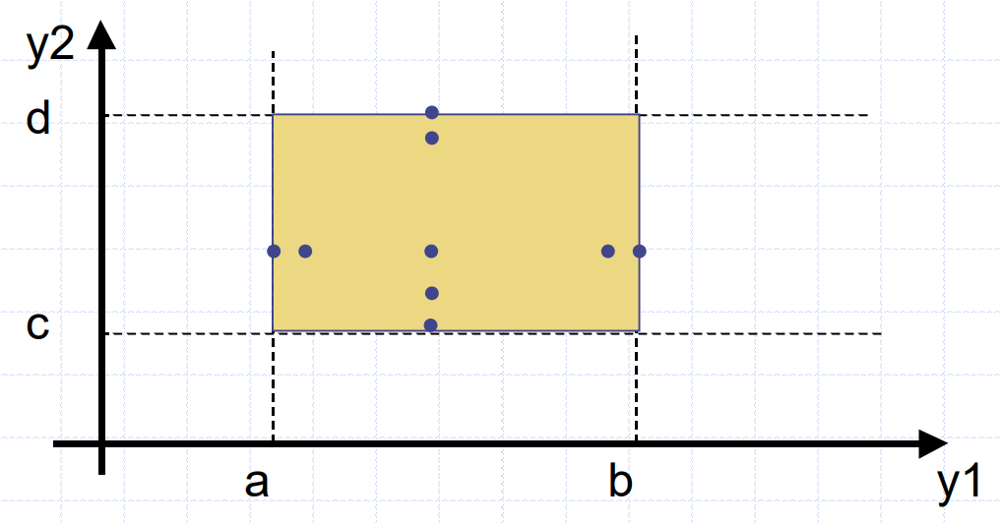
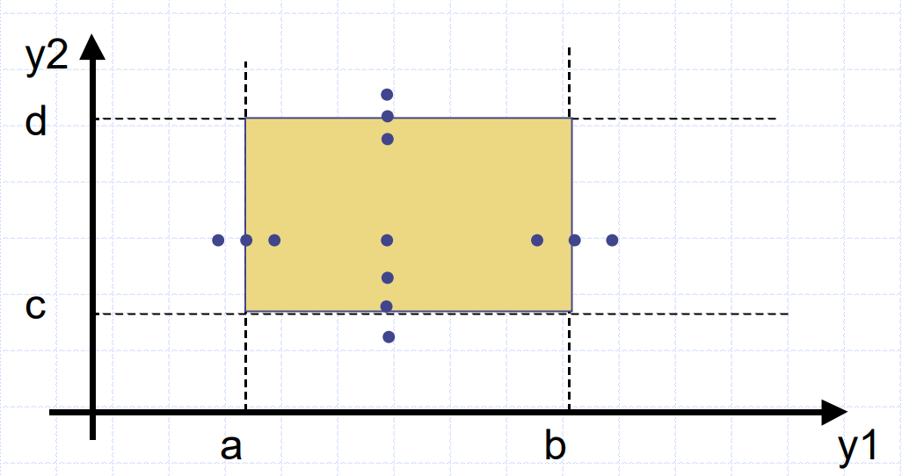
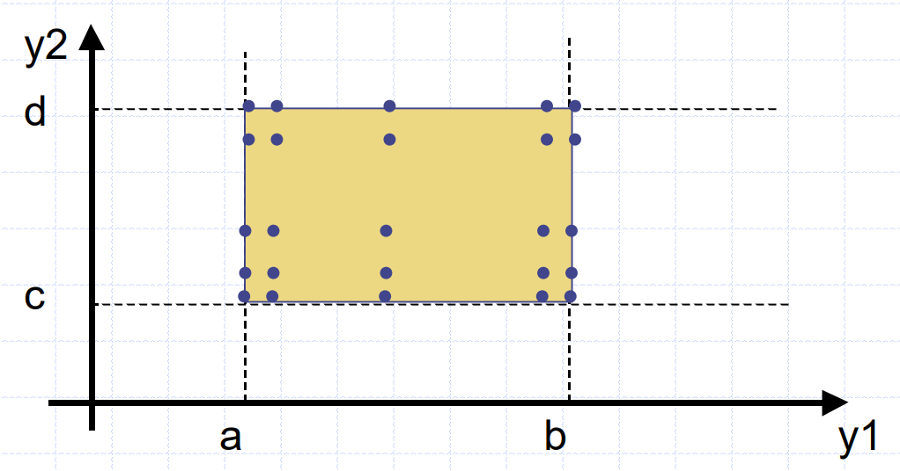
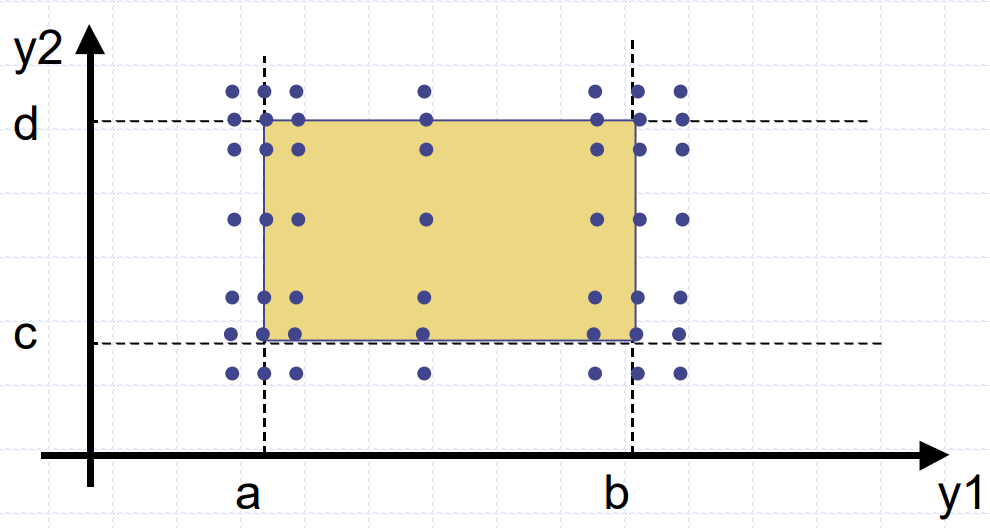
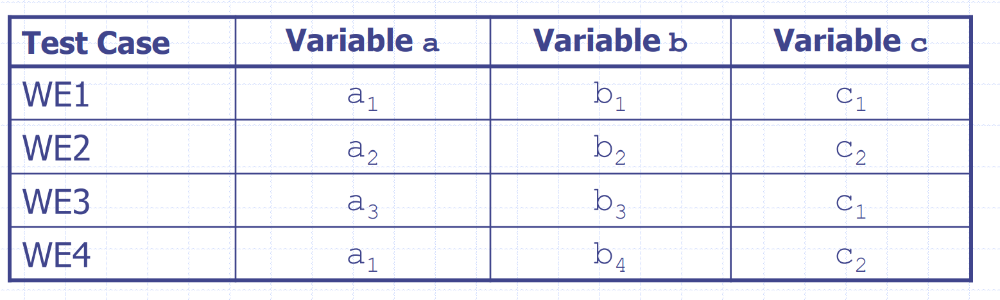
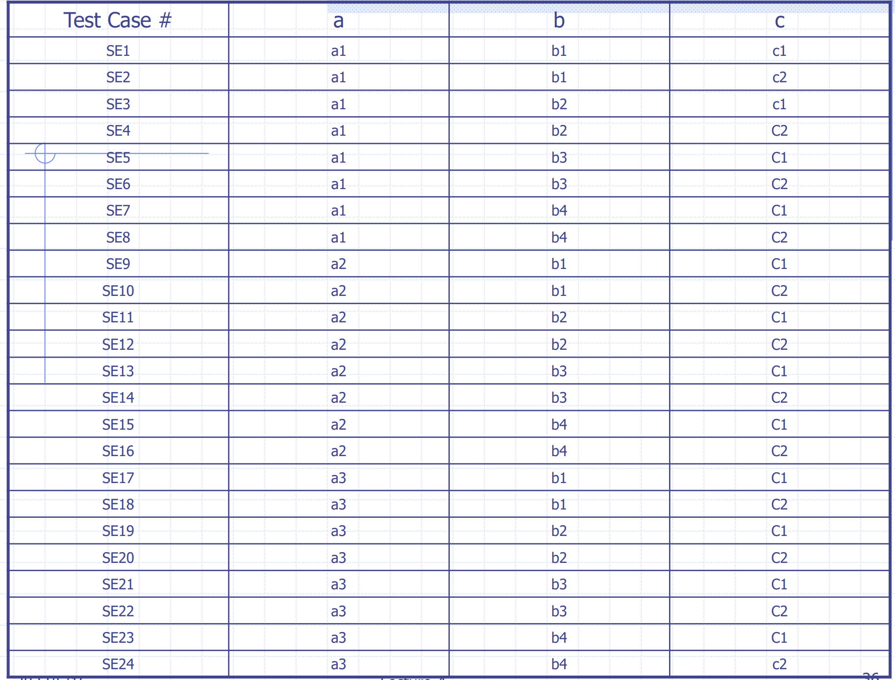
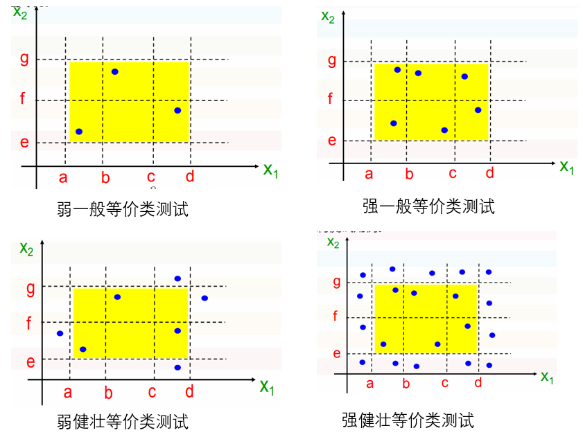
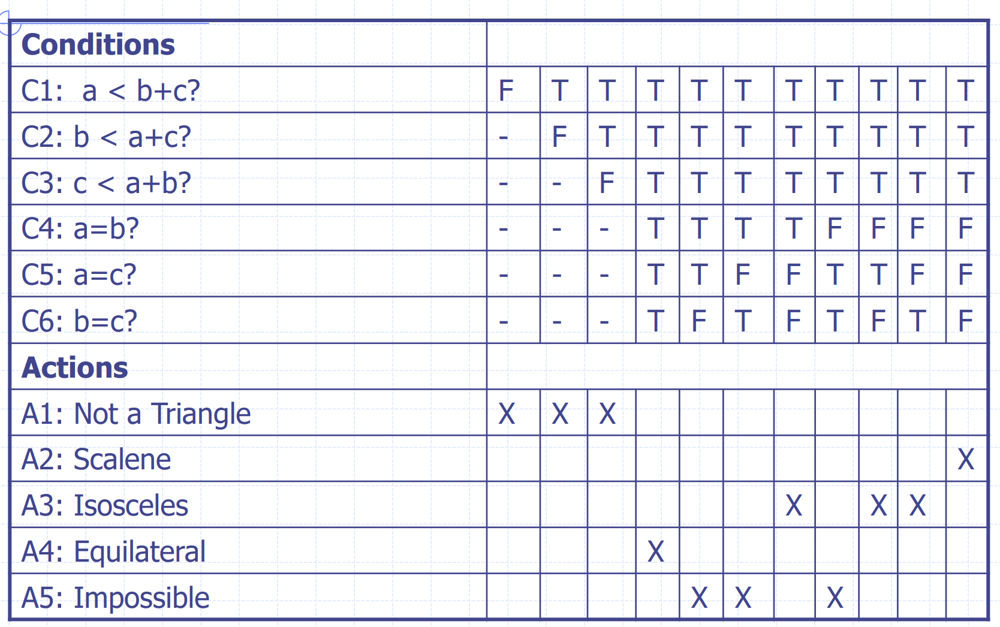
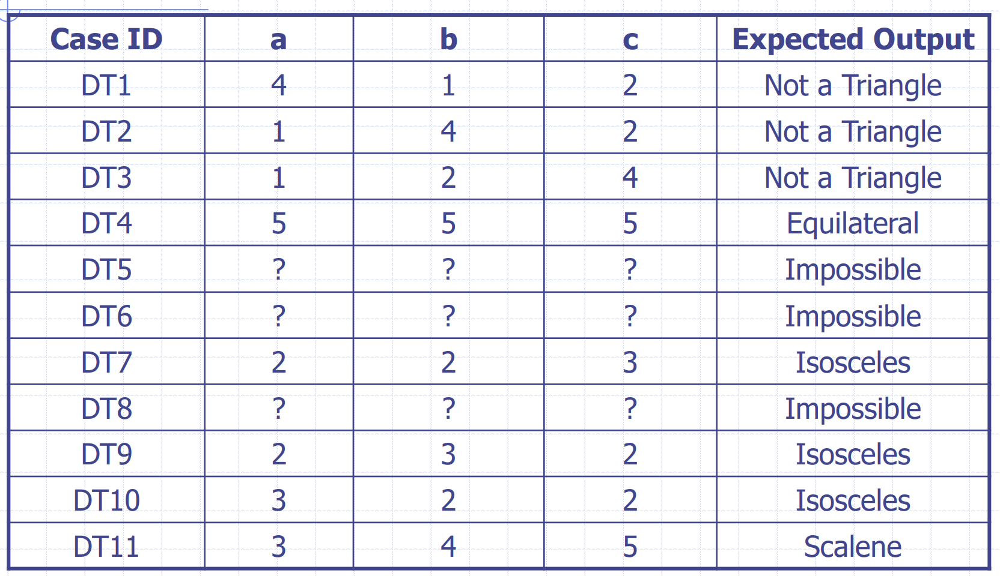

# 黑盒测试

黑盒测试也叫功能测试。

## 基于边界类的测试

即Boundary Value Testing (BVT)

考虑一个函数（程序），2个变量：
$$
f(y_1,y_2),\text{where } a \leq y_1 \leq b,c \leq y_2 \leq d
$$
**边界值测试**例子，对于n个变量，需要(4n+1)个测试用例：

**健壮性测试**例子，对于n个变量，需要(6n+1)个测试用例：

最差情况测试（**Worst Case Testing**），对于n个变量，需要$5^n$个测试用例：

**最差健壮性测试（Robust Worst Case Testing）**，对于n个变量，需要$7^n$个测试用例：

## 等价类测试

等效类构成一个集合的分区，该分区是一个相互不相交的子集的集合，其结合是整个集合。

等效类测试的想法是通过使用每个等效类中的一个元素来识别测试用例。如果明智地选择了等效类，这大大降低了测试案例的潜在冗余。等价类测试的关键点是决定类别（分区）的等价关系的选择。我们将在下面区分弱和强的等类类测试。

例如一个拥有 a,b,c 三个输入的程序，a有3种等价类，b有4种，c有2种。

**弱等类类测试**是通过在测试用例中使用每个等效类的一个变量来完成的。**测试用例的最小数量等于分区中最大数量子集的类别数量。**从上一个示例中，我们有4个测试用例：

**强等价类测试**基于分区子集的笛卡尔积。从上一个示例中，我们有$2*3*4=24$个测试用例：

## 决策表测试

决策表是建模复杂逻辑的精确但紧凑的方法。 决策表，例如if-then-else和开关语句，将条件与要执行的操作相关联。 

例子：对于三角形问题的决策表和测试用例设计

