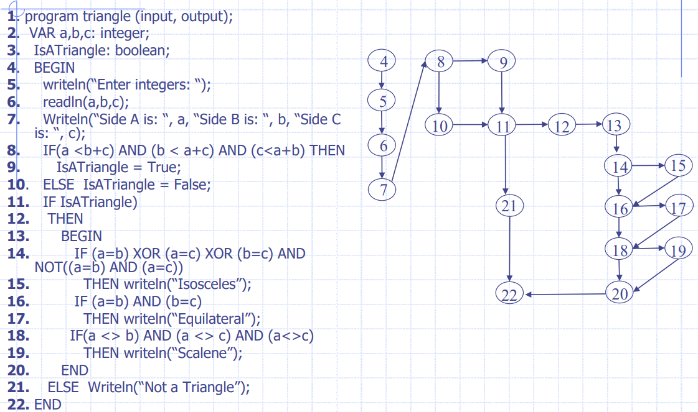
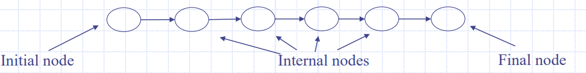
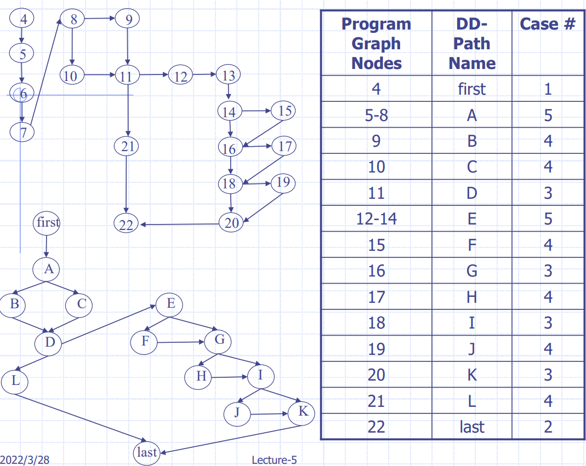
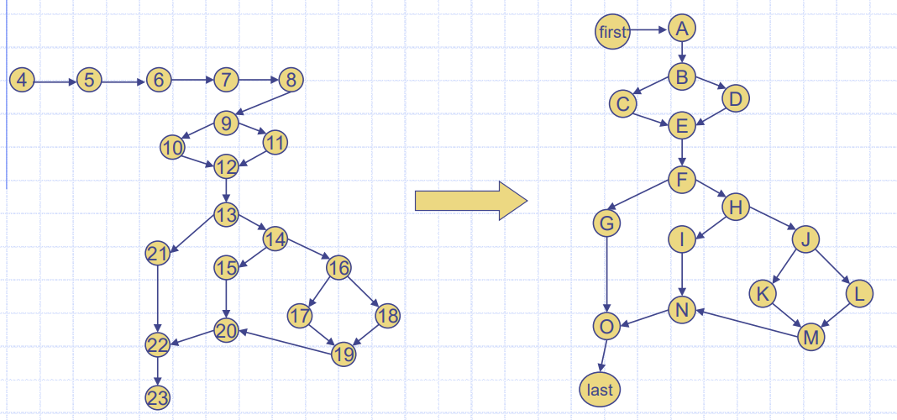
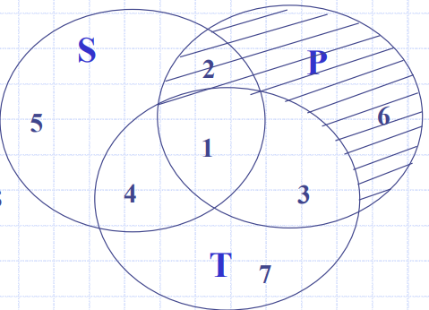
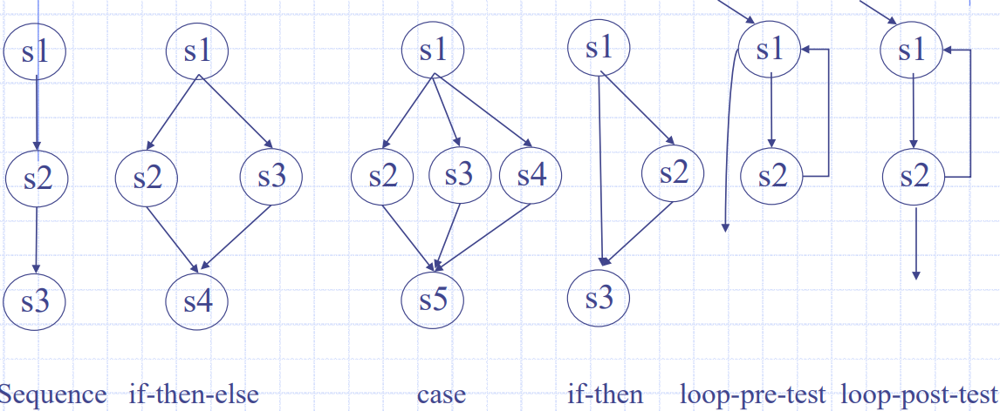
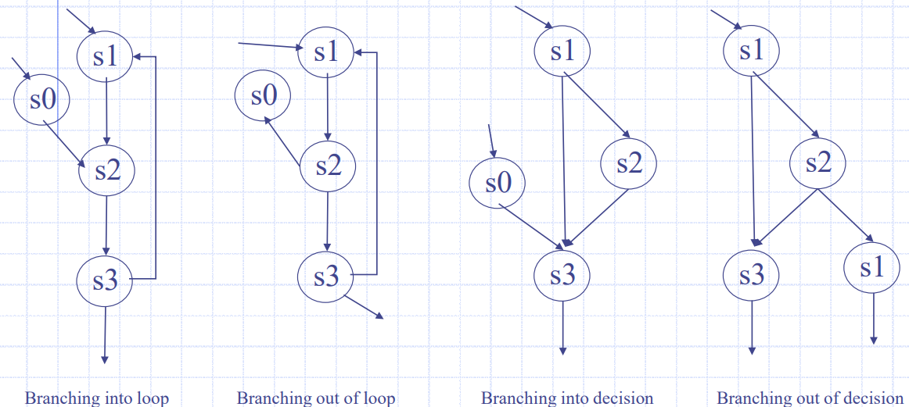
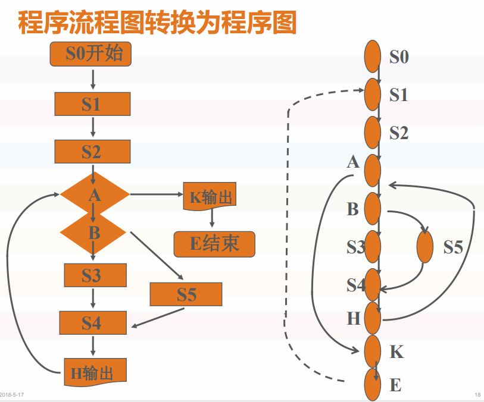

# 白盒测试

也叫结构测试

强度由低到高：

- 语句覆盖：所有的“语句”都要覆盖一遍。就是设计若干个测试用例，运行被测程序，使得每一个执行语句至少执行一次。
- 判定覆盖：包含语句覆盖，每个**判断**T、F各一次。使设计的测试用例保证程序中每个判断的每个取值分支至少经历一次。
- 条件覆盖：包含语句覆盖，每个**条件**T、F各一次是指选择足够的测试用例，使得运行这些测试用例时，判定中每个条件的所有可能结果至少出现一次，但未必能覆盖全部分支。
- 判定条件覆盖：包含判定覆盖、条件覆盖。说白了就是我们设计的测试用例可以使得判断中每个条件所有的可能取值至少执行一次（条件覆盖），同时每个判断本身所有的结果，也要至少执行一次（判定覆盖）。不难发现判定条件覆盖同时满足判定覆盖和条件覆盖，弥补了两者各自的不足，但是判定条件覆盖并未考虑条件的组合情况。
- 条件组合覆盖：每个条件的每种组合。在白盒测试法中，选择足够的测试用例，使所有判定中各条件判断结果的所有组合至少出现一次，满足这种覆盖标准成为条件组合覆盖。意思是说我们设计的测试用例应该使得每个判定中的各个条件的各种可能组合都至少出现一次。显然，满足条件组合覆盖的测试用例一定是满足判定覆盖、条件覆盖和判定条件覆盖的。
- 路径覆盖：所有路径至少执行一次。

## 代码逻辑覆盖测试

覆盖率是用来度量测试完整性的一个手段。分为逻辑覆盖和功能覆盖两大类。

逻辑覆盖包括：

- 语句覆盖。即每个语句至少能执行一次
- 判定覆盖。每个判定的分支至少执行一次。
- 条件覆盖。即一个判断语句中往往包含了若干条件（复合条件例如`a>1&&b<10`)。通过给出测试用例，使判断中的每个条件都获得各种可能的结果。
- 判断/条件覆盖。选取足够多的测试数据，使判断中每个条件都取得各种可能值，并使每个判断表达式也取到各种可能的结果。
- 条件组合覆盖。使得每个判断中条件的各种可能组合都至少出现一次。

## DD-Path

**路径测试**的重点是基于**程序图**的测试路径选择的测试技术。如果正确选择了一组路径，那么我们可以声称我们已经达到了一定的测试范围。

程序图例子：三角形问题



DD-Path 即 decision-to-decision path，DD-PATH是从程序图获得的链，其中链是一条**初始节点**和**终端节点**不同的路径，并且每个内部节点都具有indegree = 1，并且Outdegree = 1（即没有内部分支）。我们在下图中显示从程序图中选择节点以形成DD-Path链。 DD路径用于创建DD-PATH图



a DD-Path is a chain obtained from a program graph such that: 

- Case1: it consists of a single node with indeg=0. 
- Case2: it consists of a single node with outdeg=0, 
- Case3: it consists of a single node with indeg ≥ 2 or outdeg ≥ 2 
- Case4: it consists of a single node with indeg =1, and outdeg = 1 
- Case5: it is a maximal chain of length ≥ 1

## DD-Path图

给定一个程序，其DD-Path图是一个标记的有向图，其中节点是其程序图的DD-Path，而边缘表示连接DD-Paths之间的控制流。



## Basis Path

我们可以通过上面的DD-Path图识别六个可能的路径：

1. A-B-D-E-G-I-J-K-Last
2. A-C-D-E-G-I-J-K-Last
3. A-B-D-L-Last
4. A-B-D-E-F-G-I-J-K-Last
5. A-B-D-E-F-G-H-I-J-K-Last
6. A-B-D-E-F-G-H-I-K-Last

程序存在约束：

```
if Node B is traversed -> D, E are traversed
if Node C is traversed -> D, L are traversed
if Node E is traversed -> F, G, I are traversed
if Node F is traversed -> G, I are traversed
if Node H is traversed -> G, I are traversed
if Node J is traversed -> G, I are traversed
```

其中一些路径不可能，剩下：

1. A-C-D-L-Last
2. A-B-D-E-F-G-I-K-Last
3. A-B-D-E-G-H-I-K-Last
4. A-B-D-E-G-I-J-K-Last

------

另外一个例子：



我们可以通过DD-Path图识别八个可能的路径：

1. first – A – B – C – E – F – G – O – last  
2. first – A – B – D – E – F – G – O – last 
3. first – A – B – C – E – F – H – I – N – O – last 
4. first – A – B – D – E – F – H – I – N – O – last 
5. first – A – B – C – E – F – H – J – K – M – N – O – last 
6. first – A – B – D – E – F – H – J – K – M – N – O – last 
7. first – A – B – C – E – F – H – J – L – M – N – O – last 
8. first – A – B – D – E – F – H – J – L – M – N – O – last

由于代码的约束，Paths 1, 4, 6 and 8 不可能，剩下 2, 3, 5, 7

-------

我们可以将上面这些例子总结一下，一个程序和测试包括：

- 指定的程序行为，Specified program behavior (S)
- 程序可行路径，Programmed behavior (feasible paths) (P)
- 拓扑上可行的路径（包括由于程序约束不可行的路径），Topologically feasible paths (T)



- 区域1包含由可行路径实现的指定行为 - 最可取的。
- 每条可行的路径在拓扑上都是可能的，因此集合P的2,6应该为空。
- 区域3包含与未指定行为相对应的可行路径。必须检查此类额外功能。
- 区域4和7包含实际程序中不可行的路径。但是区域4是有问题的，因为它与指定行为相对应，这是编码错误。
- 区域 7 是指未指定的、不可行的、但拓扑上可能的路径（潜在的维护问题）可能成为区域 3。

## 结构化程序

结构化程序包含以下几种：



非结构化程序的例子：



