# 集成测试

目标：

- 揭示由组件组合引起的问题。
- 快速从组件获得解决方案。

## 基于功能分解的集成测试

- Top-Down：瀑布模型与自上而下的发展和功能分解密切相关。自上而下的集成测试将从主程序开始并使用**桩函数**（stub）。
- Bottom-Up：自下而上的集成测试将从较低级别的功能开始并使用**驱动程序**（driver）。
- Sandwich：以上两种结合。
- Big Bang：一次测试所有组件

以SATM系统为例，下图为分解树（decomposition tree）：

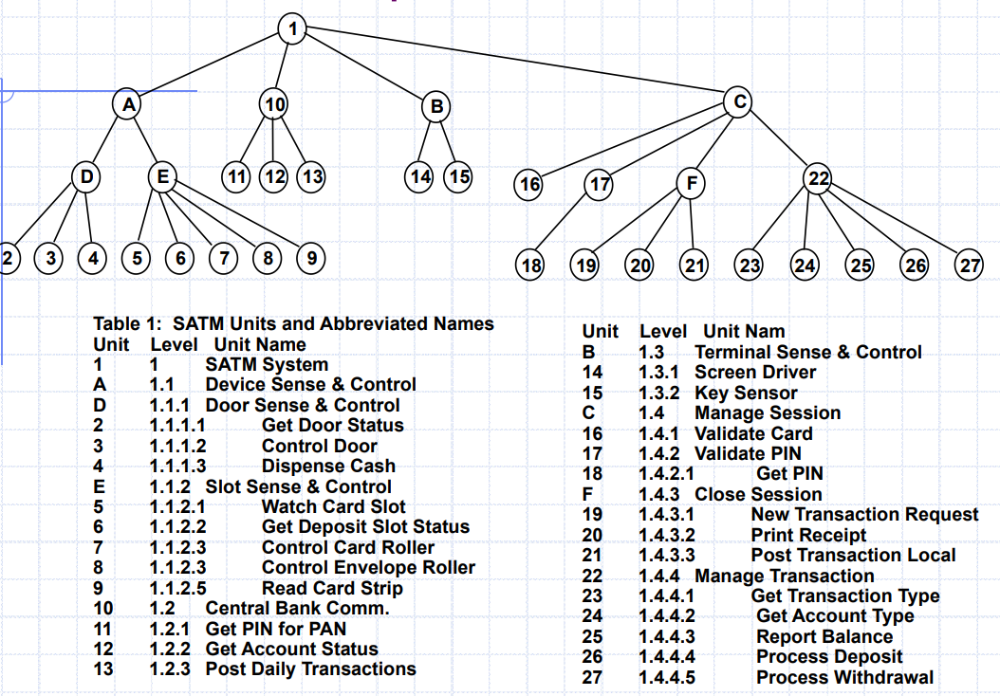

### Big Bang

一次测试所有组件

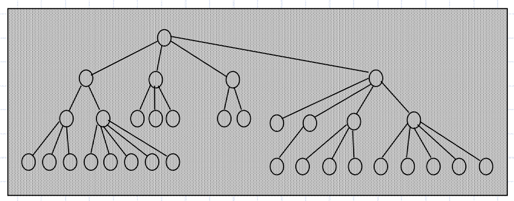

### Top-Down

自上而下的集成策略专注于首先测试顶层组件或者控制子系统。然后添加更多的子系统，这些子系统在测试应用程序时被已测试的子系统引用/要求，直到所有子系统都纳入。

需要“**桩函数（stub）**”，一种程序或方法，模拟缺失子系统的输入-输出功能。

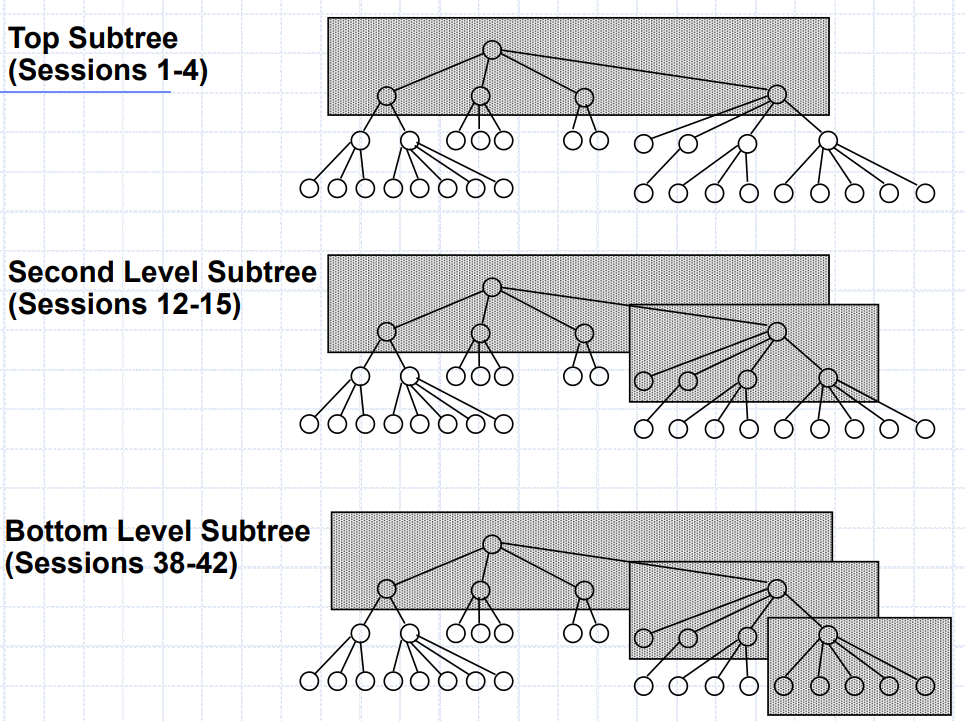

### Bottom-Up

自下而上的集成策略着重于首先测试最低级别组件。然后不断加入上层。需要**测试驱动程序**，一个“假”例程，需要一个子系统将测试用例传递给它。

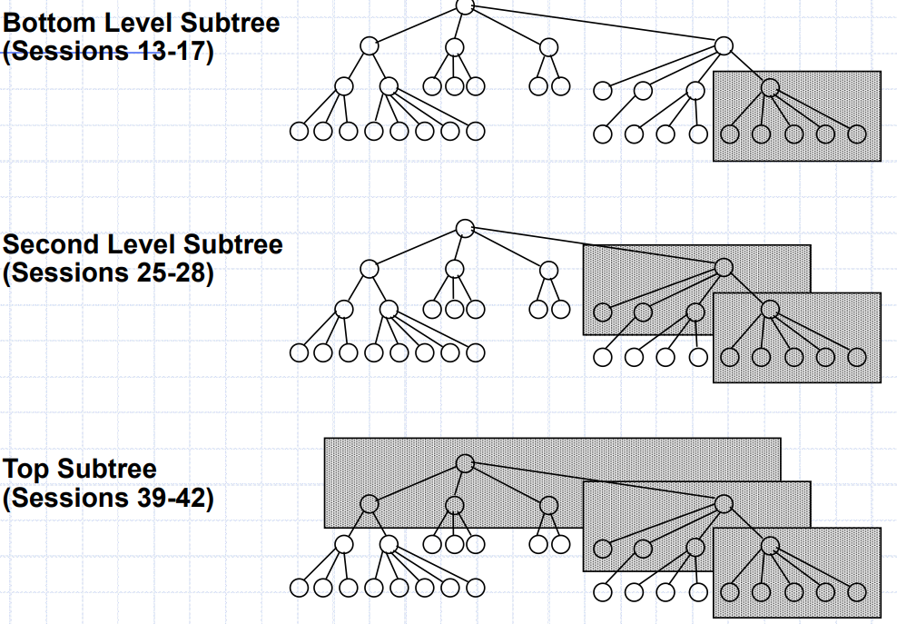

### Sandwich

将自上而下的策略与自下而上的策略结合在一起

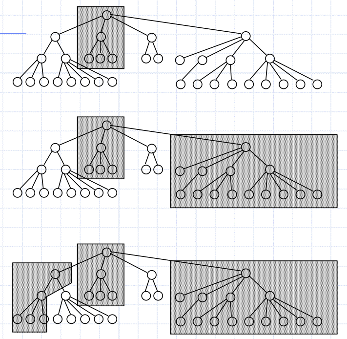

### 计算

注意桩函数、驱动与test sessions 计算方法

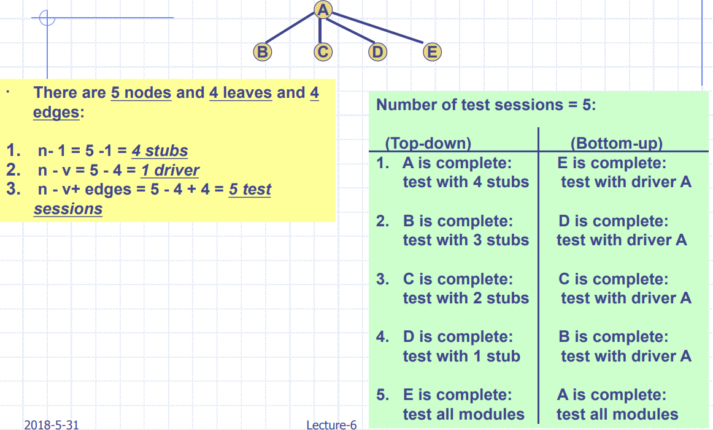

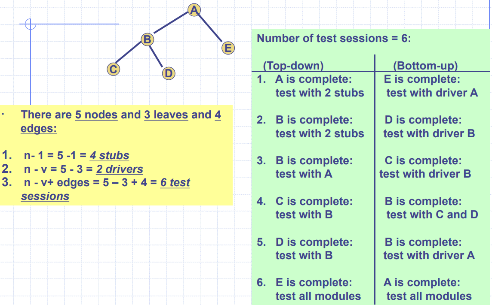

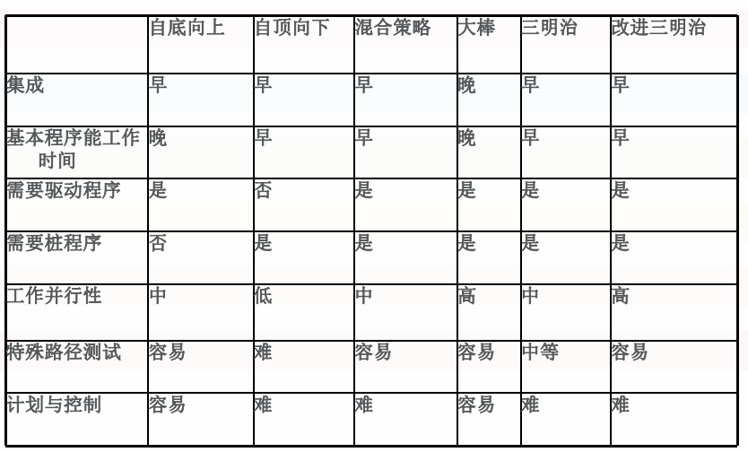

## 基于调用图的集成测试

基本思想是使用调用图（Call Graph）而不是分解树（decomposition tree）。调用图是有向标记的图，其中节点表示功能单元，边表示调用事件或资源的特定请求。

两种基于调用图的集成测试：

- Pair-wise Integration Testing配对的集成测试
- Neighborhood Integration Testing邻居集成测试

SATM系统的调用图例子：

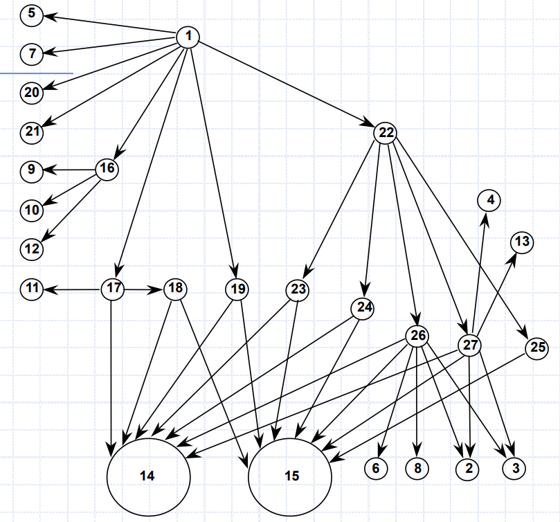

### Pair-Wise

Pair-Wise 集成测试背后的想法是消除开发桩函数/驱动程序的需要。目标是使用实际代码而不是桩函数/驱动程序。为了不将过程恶化为Big Bang策略，我们将测试会话（session）限制为调用图中的一对单位。结果是，对于调用图中的每个边，我们都有一个集成测试会话。

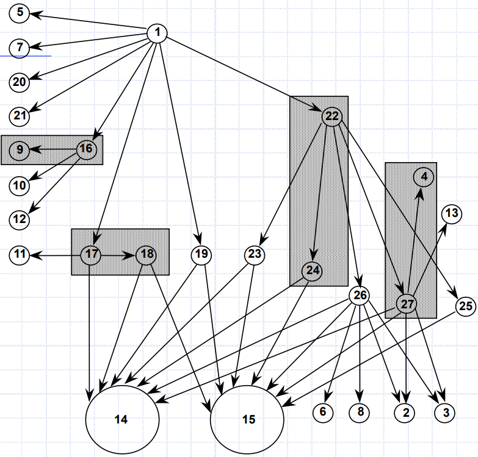

### Neighborhood

我们将图中节点的邻域(Neighborhood)定义为与给定节点相距一条边的节点集。在有向图中，邻域表示给定节点的所有直接前置节点和所有直接后继节点。可以减少测试会话的数量。

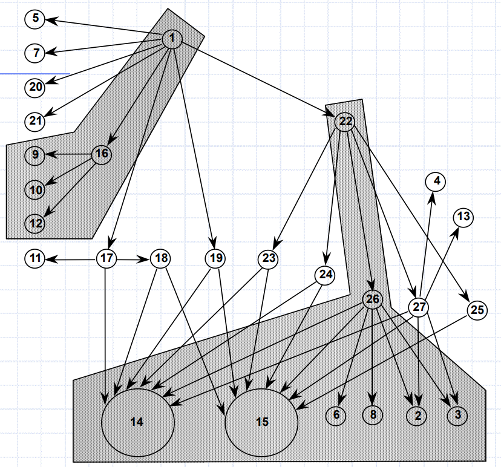

Neighborhoods 计算公式为：
$$
\text{Neighborhood} = \text{总结点}-\text{叶子结点}
$$
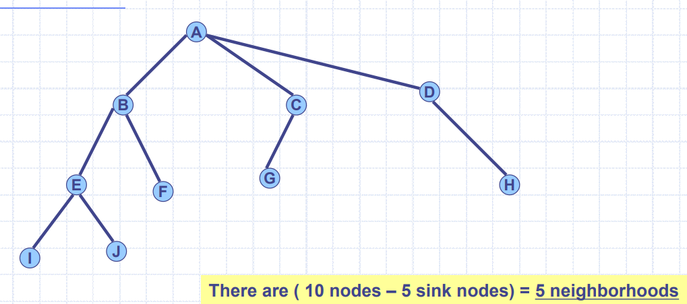

## 基于路径的集成测试

基本动机是将结构和行为类型的测试结合起来进行集成测试。其基本思想是专注于系统单元之间的**交互**，而不仅仅是测试单独开发和测试单元之间的接口。在这方面，基于接口的测试是结构化的，而基于交互的测试是行为的。

MM-Path：

- 模块执行路径（Module execution path）和消息（Message）的交错序列。
- 我们可以描述模块执行路径的序列，其中包括不同单元之间的控制权转移。
- MM-Path始终表示可行的执行路径，并且这些路径跨越单元边界。

> 模块执行路径（Module execution path）：以一头一尾的一系列语句。
>
> 消息（Message）：一种编程语言机制，通过该机制，一个单元将控制权转移到另一个单元。

MM-Path例子如下：

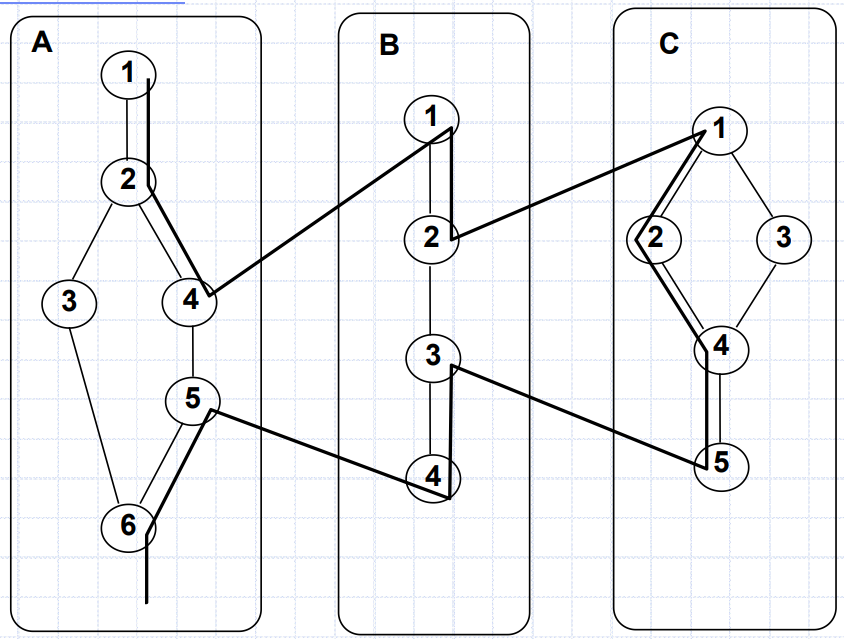

如图，以下是模块执行路径：

```
MEP(A,1) = <1,2,3,6> 
MEP(A,2) = <1,2,4> 
MEP(A,3) = <5,6> 
MEP(B,1) = <1,2>
MEP(B,2) = <3,4>
MEP(C,1) = <1,2,4,5>
MEP(C,2) = <1,3,4,5>
```

现在我们构建MM-Path图，MM-Path图是一个有向图，点是模块执行路径，边对应信息的传送：

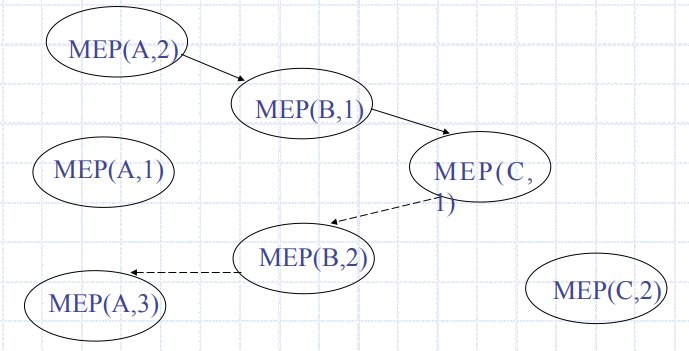

总结一下，不同集成测试需要的Testing Sessions数量：

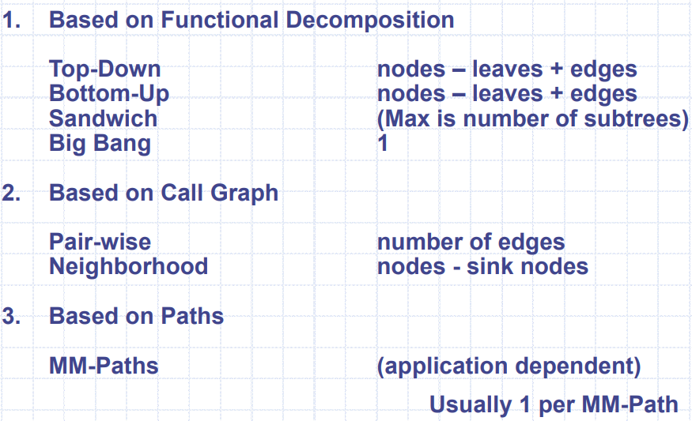