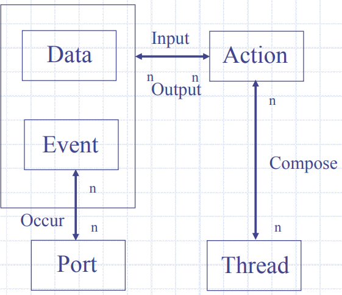
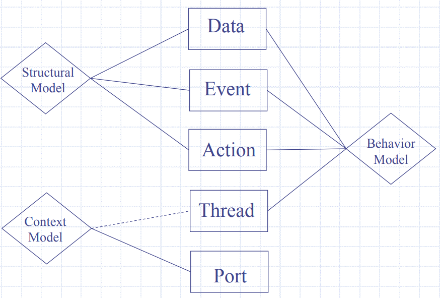
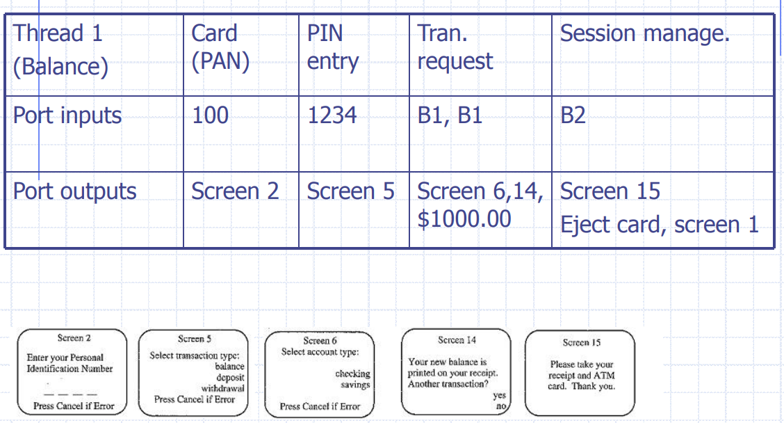

# 系统测试

在系统测试中，"Thread" （线程/线索）通常指的是在软件系统中执行的单个执行路径或单元。这里的“线程”并非指操作系统级别的线程，而是指在软件系统中执行的一系列指令的逻辑序列。这些线程通常是指用户交互或系统事件触发的不同路径，用于验证系统在各种情况下的行为是否正确。

> 举个例子，假设你在进行在线购物系统的系统测试。在这个系统中，一个线程可能是用户打开网站、浏览商品、添加商品到购物车、进行结账并支付的整个过程。另一个线程可能是用户登录、查看订单历史记录等。每个线程代表了系统中的一个特定功能或场景，并且在系统测试中，需要验证每个线程的功能是否按照预期进行。

不同层级的Thread：

- 单元测试级别的Thread：被理解为指令的执行路径或流程图上的某个路径。
- 集成测试级别的Thread：是实现某些原子功能的 MM-Path 序列。可能表示为模块执行和消息的序列。
- 系统测试级别的Thread：是原子系统函数（atomic system function, ASF）的序列

原子系统函数ASF：是系统级别的，从一个端口输入事件开始，遍历一个或多个 MM 路径，以一个输出事件结束的操作。并且没有令人信服的理由将 ASF 分解为更低级别的细节（因此是原子的）。

ASF 表示集成和系统测试之间的无缝衔接，它们是集成测试期间要测试的最大项目，也是系统测试的最小项目。

> - MM-path：模块执行路径和消息的交错序列。
> - Module exec path：同一模块中的入口-出扣路径。
> - Atomic System Function: 端口输入, …{MM-paths}, …端口输出。

线索识别方法：

- **以数据为中心的Thread识别**。对于根据其数据进行描述的系统，重点是系统使用/创建的信息，根据变量、数据结构、字段、记录、数据存储和文件进行描述。通常，线索可以直接从数据模型中识别。关系可以是 1：1、n：1 等，这些区别对处理数据的线索有影响。
- **以动作为中心的Thread识别**。以动作为中心的建模是最常见的需求规范形式。操作具有输入和输出，这些可以是数据或端口事件。操作也可以分解为较低级别的操作（即典型的数据流图）。
- **以端口为中心的Thread识别**。每个系统都有端口（和端口设备）：系统级输入和输出的来源和目标。
- **以事件为中心的Thread识别**。从某种意义上说，事件就像动作一样，它们是现实世界的物理事件与这些事件的内部逻辑表现之间的转换点。与数据一样，事件可以是操作的输入或输出。一个事件的例子是：在端口上发生的系统级输入或输出。

举例来说，对于一个ATM机，可以有以下Thread：

- 查询余额
- 存款
- 取款
- 等等等等

查询余额的Thread测试：

