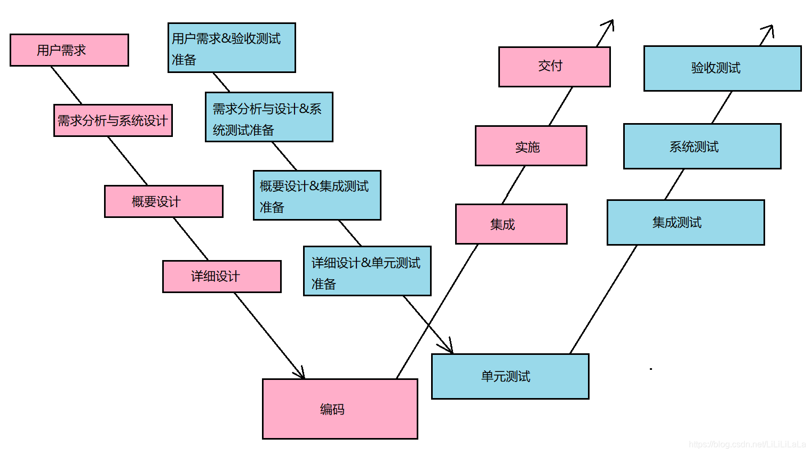

# 测开面试补充

测试开发的本质是助力业务成功，可以提前发现和定位错误，之后可以促进开发人员修正错误，从而保证交付的软件质量满足客户需求。

由于越早发现软件中存在的问题，开发费用就越低，软件质量越高，维护费用越低。，因此提前测试可以使得在需求分析时期就可发现的错误，不必等到开发完成后才被发现

- **软件测试**是在规定的条件下对一个产品或者程序进行操作，以发现**程序错误**，**衡量软件质量**，并对其是**否能满足设计要求**进行评估的过程。主要工作是检查软件是否有bug、是否具有稳定性，写出相应的测试计划、测试规范、测试用例、测试数据、测试报告，在项目中担任类似“质量管理的角色”，及时纠错及时更正，确保产品的正常运转。
- **测试开发**的核心职能依然是测试。只是工程师在具备测试经验、熟练使用测试工具并有一定开发能力的前提下，可以**自主开发平台，**或对现有的开源工具进行二次开发。**最终目的是提升产品的测试效率**。小到生成数据、并发模拟等工具的开发，大到整个自动化测试平台的设计与实现

## W模型

W模型：测试伴随着整个软件开发周期，而且测试的对象不仅仅是程序，需求、设计等同样要测试，也就是说，测试与开发是同步进行的。



1. 单元测试完成最小的软件设计单元(模块)的验证工作，目标是确保模块被正确的编码，对代码风格和规则、程序设计和结构、业务逻辑等进行静态测试，及早的发现和解决不易显现的错误
2. 集成测试通过测试发现与模块接口有关的问题。目标是把通过了单元测试的模块拿来，构造一个在设计中所描述的程序结构。
   - 一种方法是先分别测试每个模块，再把所有模块设计要求放在一起组合成所要的程序，称为非渐增式测试方法；
   - 另一种方法是要把下一个测试的模块同已经测试好的模块结合起来进行测试，称为渐增式测试。使用渐增式方法有自顶向下（需要桩）和自底向上（需要驱动）两种集成策略
3. 系统测试是对已经集成好的软件系统进行彻底的测试，以验证软件系统的正确性和性能等是否满足其规约所指定的要求。
   - 功能测试：对产品的各功能进行验证，以检查是否满足需求的要求
   - 非功能测试又可分为性能测试、压力测试、容量测试、健壮性测试、安全性测试、可靠性测试、恢复性测试、备份测试、协议测试、兼容性测试、可用性测试、配置测试、GUI测试
4. 回归测试是指在发生修改之后重新测试先前的测试用例以保证修改的正确性。理论上，软件产生新版本，都需要进行回归测试，验证以前发现和修复的错误是否在新软件版本上再次出现
5. 验收测试是部署软件之前的最后一个测试操作。目的是确保软件准备就绪，展示该系统满足用户的需求。测试方法：黑盒，验收测试包括Alpha测试和Beta测试

W模型有利于尽早地全面的发现问题。例如，需求分析完成后，测试人员就应该参与到对需求的验证和确认活动中，以尽早地找出缺陷所在。同时，对需求的测试也有利于及时了解项目难度和测试风险，及早制定应对措施，这将显著减少总体测试时间，加快项目进度。

但W模型也存在局限性。在W模型中，需求、设计、编码等活动被视为串行的，测试和开发活动也保持着一种线性的前后关系，上一阶段完全结束，才可正式开始下一个阶段工作。这样就无法支持迭代的开发模型。对于当前软件开发复杂多变的情况，W模型并不能解除测试管理面临的困惑。

## 完整的测试流程

1. 需求分析阶段。测试人员会进行需求评审，对产品的功能进行整体把握，根据需求写用例

2. 写测试计划。根据开发计划制定具体的测试时间计划

3. 撰写测试用例：根据详细的需求文档，进行用例的编写。使用思维导图列举测试大纲，尽量发散，想到什么就写什么。先放后收，对知识点进行总结和归纳，标记重点测试模块，删除冗余及重复测试点。可使用边界值法、等价类划分法、错误推测法、因果图法等设计案例。根据测试大纲制定测试用例，需包含模块名、测试优先级、操作步骤、期望结果、测试结果、备注

4. 用例评审：测试作为主导，联合开发、项目经理、PM进行测试用例评审。可先讲解测试大纲，让开发、项目经理对测试用例有个大概后再详细测试用例讲解

5. 执行测试用例：根据测试用例执行测试。发现问题保留现场，记录测试方法，通知开发解决问题。断言接口的返回数据和预期是否一致。覆盖测试用例之外若有时间可进行探索性测试

6. 缺陷报告编写及提交：将发现的缺陷编写成正式的缺陷报告，缺陷内容包括：缺陷的标题、缺陷类型、详细步骤、期望结果、缺陷等级、优先级、截图、日志信息等。提交给开发人员进行缺陷的确认和修复

7. 跟踪BUG修改情况

   执行自动化测试，编写脚本，执行，分析，报告

   进行性能测试，压力测试等其他测试，执行，分析，调优，报告

## 自动化测试

自动化测试把以人为驱动的测试行为转化为机器执行的一种过程。在预设条件下运行系统或应用程序，评估运行结果，预先条件应包括正常条件和异常条件。

- 可以对程序的新版本自动执行回归测试
- 可以执行手工测试困难或者不可能实现的测试，如压力测试，并发测试
- 能够更好的利用资源，节省时间和人力

执行自动化测试之前首先判断这个项目适不适合推广自动化测试，然后对项目做需求分析，指定测试计划，搭建自动化测试框架，设计测试用例，执行测试，评估。前提条件包括：

- 需求变动不频繁
- 项目周期足够长：自动化测试需求的确定、框架的设计、测试脚本的编写与调试均需要相当长的时间来完成，
- 自动化测试脚本可重复使用

## Bug的周期

1. **New:(新的)**：当某个bug 被第一次发现的时候，测试人员需要与项目负责人沟通以确认发现的的确是一个bug，如果被确认是一个bug，就将其记录下来。并将bug的状态设为new

2. **Assigned(已指派的)**：当一个Bug被指认为New之后，将其反馈给开发人员，开发人员将确认这是否是一个Bug,如果是，开发组的负责人就将这个bug指定给某位开发人员处理，并将bug的状态设定为assigned

3. **Open 打开的**：一旦开发人员开始处理bug的时候，他就将这个bug的状态设置为Open,表示开发人员正在处理这个Bug

4. **Fixed 已修复的**：当开发人员进行处理（并认为已经解决）之后，他就可以将这个bug的状态设置为fixed并将其提交给开发组的负责人，然后开发组的负责人将这个Bug返还给测试组

5. **Pending Reset 待在测试的**：当bug被返还给测试组后，状态设为这个

6. **Reset 再测试**：测试组的负责人将Bug指定给某位测试人员进行再测试，并将Bug的状态设置为Reset

7. **closed 已关闭的**：如果测试人员经过再次测试之后确认bug已经被解决之后，就将状态设置为closed

8. **Reopen 再次打开的**：如果经过再次测试发现bug仍然存在的话（指bug本身而不是包括因修复而引发的新bug），测试人员将bug再次传递给开发组，并将bug的状态设置为Reopen

9. **pending reject 拒绝中**：如果测试人员传递到开发组的bug 被开发人员认为是正常行为而不是Bug时，这种情况下开发人员可以拒绝，并将Bug的状态设置为pending reject

10. **rejected 被拒绝的**：测试组的负责人接到上述bug的时候，如果他发现这是产品说明书中定义的正常行为或者经过与开发人员的讨论之后认为这并不能算作Bug的时候，开发组负责人就将这个Bug的状态设置为rejected

11. **postponed 延期**：对于一些特殊的Bug的测试需要搁置一段时间，比如无效的测试数据，一些特殊的无效的功能等等，在这种情况下，Bug的状态就被设置为postponed

## 测试用例

测试用例主要包含四个内容：

- 用例标题-主要描述测试某项功能；
- 前置条件-用例标题需要满足该条件
- 测试步骤-描述用例的操作步骤
- 预期结果-符合预期需求（开发规格书、需求文档、用户需求等）

### 用户登录测试分析

> [参考以及其他例子](https://zhuanlan.zhihu.com/p/608942743)

**功能测试-输入用户名和密码**：

- 用户名和密码，太短或太长的处理（边界值法）
- 用户名和密码，有特殊字符(比如空格)及其他非英文的情况
- 记住用户名，记住密码
- 登录失败后，不记录密码
- 用户名和密码前后有空格的处理
- 密码是否是密文显示，使用*号或圆点等符号代替
- 验证码的辨认难度，考虑颜色（色盲使用者），刷新或换一个按钮是否好用
- 输入密码时，大写键盘开启时是否有提示信息
- 什么都不输入，点击提交按钮，检查提示信息

**登录流程：**

- 正常流程（正确账号密码，点击提交，验证能否正确登录）
- 异常流程（错误的账号密码，点击提交，验证登录失败，并提示相应错误信息）
- 登录成功后能否正确跳转
- 登录token测试

**界面测试：**

- 布局是否合理，按钮和表单是否整齐
- 按钮和表单高度和长度是否符合要求
- 界面风格是否符合UI设计稿
- 文字有无错别字

**性能测试：**

- 打开登录界面，需要的时间是否在需求要求的时间内
- 输入正确的账号密码，点击登录，是否在需求时间内跳转成功
- 模拟大量用户同时登录，检查一定压力下能否正常跳转

**安全性测试**：

- 用户名或密码是否通过加密方式，发送给后端服务器
- 用户名和密码应该在[前端和后端](https://zhida.zhihu.com/search?q=前端和后端&zhida_source=entity&is_preview=1)做双重验证
- 用户名和密码的输入框，应该屏蔽SQL注入攻击
- 用户名和密码的输入框，应该禁止输入脚本（防止XSS攻击）
- 防止暴力破解，检测是否有错误登录的次数限制
- 是否支持多用户在同一机器上登录
- 同一用户能否在多台机器上登录

**可用性测试：**

- 是否可以用全键盘操作，是否有快捷键
- 输入用户名，密码后按回车，是否可以登录
- 输入框是否可以Tab切换

**兼容性测试**：

- 不同浏览器下能否显示正常，且功能正常
- 同种浏览器下不同版本能否显示正常且功能正常
- 不同的操作系统是否能正常工作
- 移动设备上是否正常工作

## 接口测试流程

先要进行需求分析，然后开发开发代码时，熟悉项目需求。等待开发提测试接口后，拿到接口文档，然后根据接口文档设计测试用例，使用 postman 工具进行接口测试，经过3天的测试，一般能够完成一轮的接口测试。测试完成后，如果所有测试用例都执行完毕，并且所有的bug都回归测试通过，没有严重等级bug之后，就可以移交功能测试。

在功能测试人员进行功能测试时，我们可以编写自动化接口测试代码，然后进行接口层的回归测试。同时，我们接口测试人员会提前在UAT验收环境进行部署和回归测试。等UAT回归通过之后，前端测试就可以介入UAT测试。

等前端测设通过并发布上线之后，我们可以在UAT 环境使用持续集成技术，持续的监控已发布的版本质量，达到保证项目质量的目的

最后，我们使用接口测试自己数，对人力管理系统进行利系统接口层测试，测试效率比功能测试回归的效率高了16倍，功能测试需要花费一天的时间才能执行完成回归测试工作，我们接口人员利用自动化接口测试技术，只花了半个小时。而且还能持续的监控旧版本的代码质量，提高我们的测试效率

这里面，我们使用Postman的断言，关联、引入外部数据文件，对接口进行测试。并且使用newman工具来生成HTML报告，利用mysql来连接数据库，校验数据库的数据。其中，一些大数据的测试场景，我们使用csv文件来完成测试。

## Junit

JUint是Java编程语言的单元测试框架，用于编写和运行可重复的自动化测试。

JUnit 促进了“先测试后编码”TDD，Test-Driven Development（测试驱动开发）的理念，强调建立测试数据的一段代码，可以先测试，然后再应用。这个方法就好比“测试一点，编码一点，测试一点，编码一点……”，增加了程序员的产量和程序的稳定性，可以减少程序员的压力和花费在排错上的时间。

> maven工程中引入单元测试
>
> ```xml
> <dependency>
>     <groupId>junit</groupId>
>     <artifactId>junit</artifactId>
>     <version>4.12</version>
>     <scope>test</scope>
> </dependency>
> ```

首先要分清几个概念：测试方法、测试类、测试集、测试运行器。

1. 其中测试方法就是用@Test注解的一些函数。
2. 测试类是包含一个或多个测试方法的一个Test.java文件，
3. 测试集是一个suite，可能包含多个测试类。
4. 测试运行器则决定了用什么方式偏好去运行这些测试集/类/方法。 而@Runwith就是放在测试类名之前，用来确定这个类怎么运行的。


| 注解          | **描述**                                                     |
| ------------- | ------------------------------------------------------------ |
| @Test         | 测试注解，标记一个方法可以是测试用例                         |
| @Before       | Before注解表示，该方法必须在类中的每个测试之前执行,以便执行某些必要的先决条件。每个测试方法都会运行一次 |
| @After        | After注释表示，该方法在每项测试后执行（如执行每一个测试后重置某些变量，删除临时变量等）。每个测试方法都会运行一次 |
| @BeforeClass  | BeforeClass注解指出这是附着在静态方法必须执行一次并在类的所有测试之前，这种情况一般用于测试计算、共享配制方法(如数据库连接)。每个测试类只运行一次 |
| @AfterClass   | 当需要执行所有测试在JUnit测试用例类后执行，AlterClass注解可以使用以清理一些资源（如数据库连接），注意：方法必须为静态方法。每个测试类只运行一次 |
| @Ignore       | 当想暂时禁用特定的测试执行可以使用这个注解，每个被注解为@Ignore的方法将不再执行 |
| @Runwith      | 放在测试类名之前，用来确定这个类怎么运行的。也可以不标注，会使用默认运行器。@RunWith(Parameterized.class) 参数化运行器，配合@Parameters使用JUnit的参数化功能 |
| @SuiteClasses | 用于套件测试                                                 |
| @Parameters   | 用于使用参数化功能。                                         |

例子，可以在IDEA中跑一下，顺便测测代码覆盖率：

```java
import org.junit.*;
public class JunitTest1 {
    @BeforeClass  // 只执行一次
    public static void beforeClass() {System.out.println("in before class");}
    @AfterClass  // 只执行一次
    public static void afterClass() {System.out.println("in after class");}
    @Before  // 执行了多少个@Test就执行了几次
    public void before() {System.out.println("in before");}
    @After  // 执行了多少个@Test就执行了几次
    public void after() {System.out.println("in after");}
    @Test
    public void testCase1() {System.out.println("in test case 1");}
    @Test
    public void testCase2() {System.out.println("in test case 2");}
}
```

时间测试：

```java
@Test(timeout = 1000) //毫秒
public void testCase3() throws InterruptedException {
    TimeUnit.SECONDS.sleep(5); // import java.util.concurrent.TimeUnit;
    System.out.println("in test case 1");
}
```

异常测试：

```java
@Test(expected = ArithmeticException.class)
public void testCase3() {
    int a = 0;
    int b = 1 / a;
}
```

Junit 4 引入了一个新的功能参数化测试。参数化测试允许开发人员使用不同的值反复运行同一个测试

```java
@Test
public void testPrimeNumberChecker() {
    // inputNumber 和 expectedResult 来自测试类已经定义好的Collection
    System.out.println("Parameterized Number is : " + inputNumber);
    // 待测试方法是primeNumberChecker.validate
    Assert.assertEquals(expectedResult,
                        primeNumberChecker.validate(inputNumber));
}
```

## ApiPost

ApiPost是一款支持模拟POST、GET、PUT等常见HTTP请求,支持团队协作,并可直接生成并导出接口文档的API 文档、调试、Mock、测试一体化协作性能非常强大的工具。简单说：ApiPost = Postman + Swagger + Mock 

ApiPost产生的初衷是为了提高研发团队各个角色的效率！产品的使用受众为由前端开发、后端开发和测试人员以及技术经理组成的整个研发技术团队。ApiPost通过协作功能将研发团队的每个角色整合打通。

## UFT

UFT（Unified Functional Testing） 即原来的QTP（Quick Test Professional Software）与ST（Service Test）合并而来，由HP公司开发，是一个企业级的商业自动化测试工具，提供了强大易用的录制回放功能， 同时兼容对象识别模式与图像识别模式，支持B/S和C/S两种架构的软件测试。

## Selenium

应用于web的自动化测试工具，支持多平台、多浏览器、多语言来实现自动化
