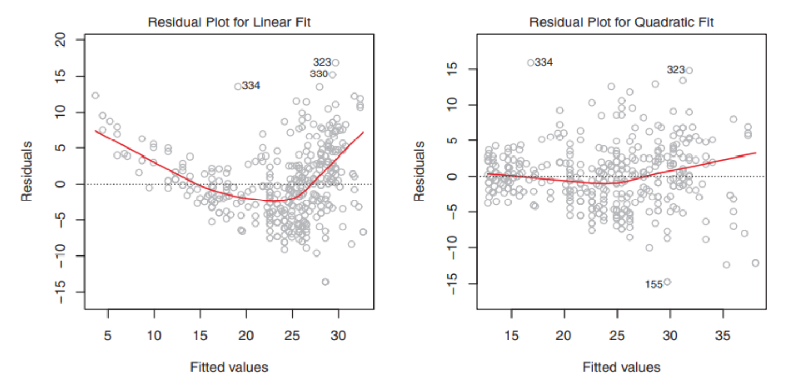
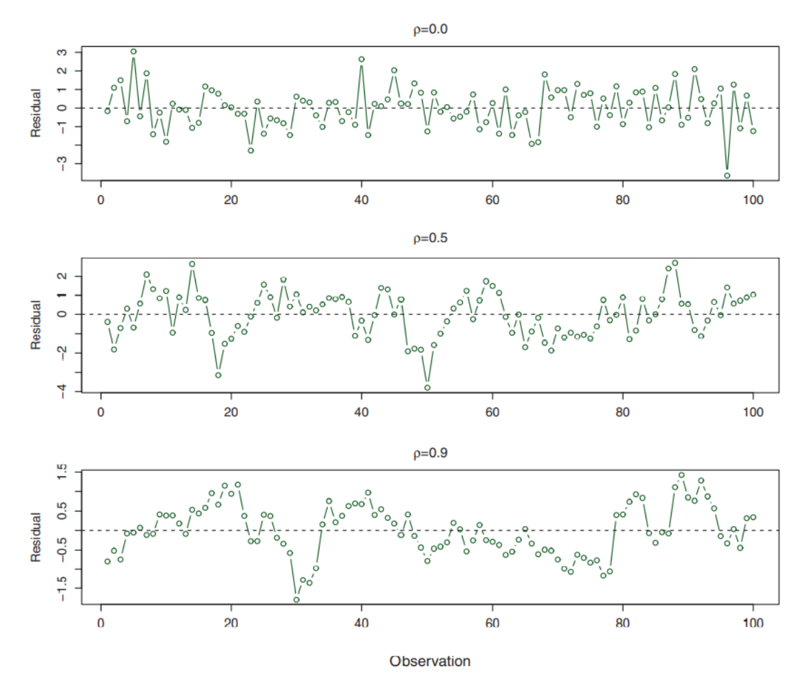
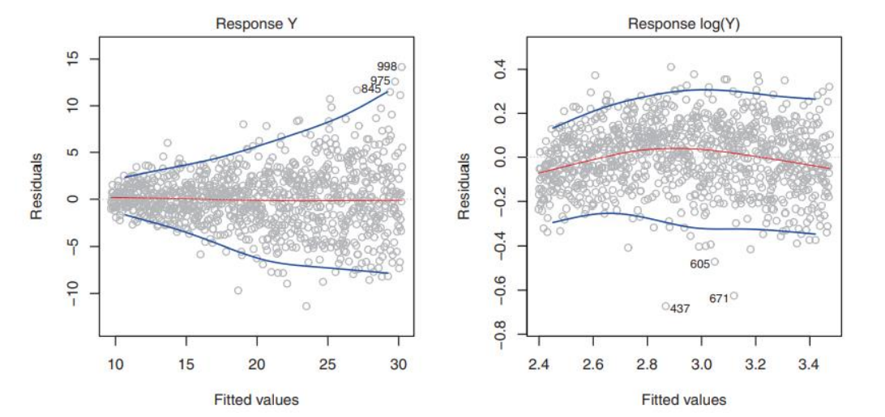

# 线性回归

## 3.0 基本问题

- 线性回归经常讨论哪些问题？
- 估计参数测量接近程度的常⽤⽅法是？
- 总体均值的标准误差计算？残差的标准误差呢？ 
- 置信区间如何计算？
- 如何判断预测变量和响应变量之间存在相关性？
- t检验中p值是如何确定的？
- 典型的临界p值有哪些？
- 判断线性回归的拟合质量的标准？
- 如何计算随机变量之间的相关性？
- 为什么有些变量在简单线性回归中表现出很强的相关性，⽽在多元线性回归中显现出较低的相关性？
- 如何判断多个响应变量和预测变量之间有关系？
- 多元分析如何选择重要的变量？
- 拒绝向后选择的条件有哪些？
- 可约误差和不可约误差的判断⽅式是什么？
- 哑变量和⽔平数的关系？
- 什么是基准⽔平？
- 线性模型的假设有哪些？
- 如何去除可加性假设？
- 什么是实验分层原则？
- 如何去除线性假设？
- 线性模型存在的问题？
- 如何精确地估计某⼀个预测变量对响应变量的影响？如何判断未来的预测精度呢？ 
- KNN回归和分类的具体区别？

## 3.1 简单线性回归

线性关系记为：
$$
Y=\beta_0 + \beta_1X
$$

线性回归经常讨论的⼀些问题：是否有关系、关系有多强、那些变量有关系、关系是否线性、预测精度如何、是否有协同作⽤、那种变量促进响应变化。

### 3.1.1 估计系数方法

观测和预测值的差距定义为**残差平方和RSS**：
$$
RSS=\sum_{i=1}^n (y_i- \hat{y_i})^2
$$
> 对比一下，均方误差MSE的计算方法：
> $$
> MSE = \frac{1}{n}\sum_{i=1}^{n}(y_i-\hat{f}(x_i))^2
> $$

**最小二乘法**的目的是使RSS最小，计算得出的结果是：
$$
\hat{\beta}_1=\frac{\sum_{i=1}^n(x_i-\bar{x})(y_i-\bar{y})}{\sum_{i=1}^n(x_i-\bar{x})^2}
$$

$$
\hat{\beta}_0=\bar{y}-\hat{\beta}_1 \bar{x}
$$

其中，$\bar{y}$ 和 $\bar{x}$ 是样本均值。

### 3.1.2 评估系数估计值的准确性

问：样本均值 $\hat{\mu}$ 作为 $\mu$ 的估计是无偏的，但是有多稳定？

> ⼀个⽆偏估计不会系统地⾼估或者低估真实参数

答：计算 $\hat{\mu}$ 的方差和标准误差(standard error)：
$$
\text{Var} (\hat{\mu}) = \text{SE}(\hat{\mu})^2 = \frac{\sigma ^2}{n}
$$
其中，$\sigma$ 是 Y 中每个 $y_i$ 的标准差

> 补充：标准差**（Standard Deviation）**和标准误**（standard error）**是不同的概念，标准差是偏离；标准误是误差。
> $$
> 总体标准差 \sigma =\sqrt{\frac{\sum_{i=1}^n(x-\mu)^2}{n}}
> $$
>
> $$
> 样本标准差 S =\sqrt{\frac{\sum_{i=1}^n(x-\bar{x})^2}{n-1}}
> $$
>
> $$
> 标准误差 \sigma_n= \frac{\sigma}{\sqrt{n}}
> $$

标准误差可用于计算置信区间 (confidence interval)，95%置信区间被定义为一个取值范围：该范围有95%的概率会包含未知参数的真实值，例如：
$$
\hat{\beta} \pm 2 \cdot \text{SE}(\hat{\beta})
$$
标准误差也可以用来对系数进行假设检验(hypothesis tests)。最常用的假设检验包括对零假设(null hypothesis)和备择假设(alternative hypothesis) 进行检验：
$$
H_0 ：X和Y之间没有关系，即 \beta_1=0
$$

$$
H_1：X和Y之间有一定的关系，即 \beta_1 \neq 0
$$

为了检验零假设，我们计算 t 统计量(t-statistic)：
$$
t=\frac{\hat\beta_1-0}{SE(\hat\beta_1)}
$$
如果 $\beta_1$ = 0，那我们预期它将服从自由度为 n−2 的 t 分布。那么假设 $\beta_1$ = 0，很容易计算任意观测值大于等于 t 的概率，我们称这个概率为p值(p-value)， 如果P值足够小（小于5%或者1%），那么我们拒绝零假设，接受备择假设，即认为X和Y之间有关系。

### 3.1.3 量化模型拟合数据的程度

一旦我们拒绝零假设，就会很自然地想要量化模型拟合数据的程度。判断线性回归的拟合质量通常使用两个相关的量： 

- 残差标准误 (residual standard error , RSE)。如果RSE很大，那么表明模型没有很好的拟合数据。
-  $R^2$统计量。表示了能解释多少响应变量的变异。我们希望这个统计量接近1，即模型能够解释绝大部分响应变量的变异。

$$
RSE=\sqrt{\frac{1}{n-2}RSS}
$$

$$
R^2=1-\frac{RSS}{TSS}
$$

其中，TSS总平方和(total sum of squares)为 $\sum (y_i-\bar{y})^2$

## 3.2 多元线性回归

即存在 p 个预测变量：
$$
Y=\beta_0+\sum_{i=1}^p \beta_pX_p + \epsilon
$$

> 系数的解释：所有其他预测变量保持不变的情况下，增加⼀个单位对Y产生的**平均**效果

### 3.2.1 估计回归系数

我们继续以得到最小的RSS为目的进行最小二乘来估计系数，计算RSS的公式不变。

有些变量在简单线性回归中表现出很强的相关性，⽽在多元线性回归中显现出较低的相关性，因为变量之间可能存在相关性。

### 3.2.2 判断 X 与 Y 有关

如何判断响应变量和预测变量之间有关系？我们可能会为每一个变量单独计算p值，但这么做在多元线性回归中是不推荐的，应当综合考虑所有的变量，即：
$$
零假设H_0：所有预测变量与响应变量都无关，即 \beta_1=...\beta_p=0
$$

$$
备择假设H_1：至少有一个 \beta_j 不为0
$$

我们用 F 统计量回答：
$$
F=\frac{(TSS-RSS)/p}{RSS/(n-p-1)}
$$
当响应变量与预测变量无关，F统计量应该接近1，否则大于1。

> 每个变量的t检验都等价于不含该变量，但包含所有其他变量的模型的F检验。

### 3.2.3 选择重要的变量

三种方法：

1. 向前选择。从零模型开始，每次加入一个新变量，选择依据是让RSS最小。
2. 向后选择。从包含所有变量的模型开始，每次删除p值最大的变量。
3. 混合选择。向前选择与向后选择的综合。

> p > n 时，不能使用向后选择，因为模型拟合不出来。

### 3.2.4 衡量拟合效果

同简单线性回归，使用RSE和$R^2$统计量，$R^2$统计量的公式不变，RSE的一般形式为：
$$
RSE=\sqrt{\frac{1}{n-p-1}RSS}
$$
在简单线性模型中，p=1

当加入一个新变量时，RSS会减小，但因为RSE的分母上存在p，RSE也可能变大。

### 3.2.5 预测的偏差

- 可约误差，即预测系数的误差。
- 模型偏差，模型本身可能是错误的。
- 不可约误差。

预测区间总是比置信区间宽。

## 3.3 其他注意事项

### 3.3.1 定性的变量

对于二值变量，例如男或女，我们创建一个哑变量：
$$
x_i = \left \{ 
    \begin{aligned}
    &1 & 女性 \cr 
    &0 & 男性 \cr 
    \end{aligned}
\right.
$$
应用于回归方程：
$$
y_i=\beta_0 + \beta_1 x_i+ \epsilon_i=
\left \{ 
    \begin{aligned}
    &\beta_0 + \beta_1 + \epsilon_i & 女性 \cr 
    &\beta_0 +  \epsilon_i & 男性 \cr 
    \end{aligned}
\right.
$$
没有相对应的哑变量的水平，例如本例中的男性，被称为基准水平 (baseline)。

当一个定性预测变量有两个以上的水平，记为 k 个，可以使用 (k-1) 个哑变量实现。

### 3.3.2 可加性假设

标准线性回归模型提供了可解释的结果，但它作了一些高度限制性的假设。两个最重要的假设是预测变量和响应变量的关系是可加(additive)和线性 (linear)的。

可加性假设是指，预测变量 $x_j$ 的变化对响应变量 Y 产生的影响与 其他预测变量的取值无关。

放宽可加性假设，引入交互作用(interaction)，考虑包含两个预测变量的线性回归模型，现在我们加入交互项。
$$
Y=\beta_0 +\beta_1X_1+\beta_2X_2+\beta_3X_1X_2+\epsilon
$$
实验分层原则(hierarchical principle)：如果模型中含有交互项，那么即使主效应的系数的p值不显著， 也应包含在模型中。这一原则的合理性在于，如果没有主效应项，那两者之间的交互作用将很难解释。

### 3.3.3 线性假设

线性假设是指，无论 $x_j$ 取何值，$x_j$ 变化一个单位引起的响应变量 Y 的变化是恒定的。我们扩展思路，提出多项式回归：
$$
Y=\beta_0 +\beta_1X+\beta_2X^2+\beta_3X^3+....+\epsilon
$$

### 3.3.4 识别非线性

残差图（residual plot）可用于识别非线性。我们可以绘制残差 $e_i=y_i-\hat{y}_i$ 和预测变量 $x_i$ 的散点图。

理想情况，残差图显示不出明显的规律。若存在明显规律，则表示 线性模型的某些方面可能有问题。

- 左图残差呈现明显的U型，这为数据的非线性提供 了强有力的证据。
- 右图展示的残差似乎没有规律，我们希望这样。

### 3.3.5 误差自相关

线性回归模型的一个重要假设是误差项 $\epsilon_1, \epsilon_2 ...  \epsilon_n$ 不相关。如果误差项相关，那么估计标准误往往低估了真实标准误。

误差项自相关经常出现在时序序列数据 ，很多 时候相邻时间点获得的 观测的误差有正相关关系。我们可以根据模型绘制作为时间函数的残差 ， 如果误差项不相关，图中没有明显规律，否则，可能在残差中看到跟踪现象 。

- 最上面的图没有规律，我们喜欢这样。
- 最下面的图中，相邻的残差类似，存在误差自相关问题。

### 3.3.6 误差项方差非恒定

线性回归模型的另一个重要假设是误差项的方差是恒定的。

但通常，误差项的方差不是恒定的。例如，误差项的方差可能会随响应值的增加而增加，如果残差图呈漏斗形，说明误差项方差非恒定或存在异方差性。可以用凹函数对响应值y做变换，例如 $log(y)$ ， $\sqrt{y}$ ，进而使较大的响应值有更大的收缩。

- 左图，残差图呈漏斗形，说明误差项方差非恒定或存在异方差性。
- 右图，残差稳定，我们喜欢这样。

### 3.3.7 离群点

指 $y_i$ 远离模型预测的点。

单个数据点造成RSE的急剧增加可能影响对拟合的解释。

残差图可以用来识别离群点。可以绘制学生化残差，即由残差 $e_i$ 除以它的估计标准误得到。学生化残差绝对值大于3的观测点可能是离群点。

如果确信是离群点是由于数据采集或记录中的错误导致的，可以直接删除。

### 3.3.8 高杠杆点

 高杠杆表示观测点 $x_i$ 是异常的。

为了量化观测的杠杆作用，可计算杠杆统计量。一个大的杠杆统计量对应一个高杠杆点：
$$
h_i=\frac{1}{n}+\frac{(x_i-\bar{x})^2}{\sum_{i'=1}^n (x_{i'}-\bar{x})^2}
$$
杠杆统计量 $h_i$ 的取值总是在1/n和1之间，且所有观测的平均杠杆值总是等于(p+1)/n。因此，如果给定观测的杠杆统计量大大超过(p+1)/n， 那么我们可能会怀疑对应点有较高杠杆作用。

### 3.3.9 共线性

共线性是指两个或更多的预测变量高度相关。

它会导致难以分离单个变量对响应值的影响。假设检验的效力也被共线性减小了。

检测共线性的一个简单方法是看预测变量的相关系数矩阵。但即使 没有某对变量具有特别高的相关性，有可能三个或更多变量之间存 在共线性，成为多重共线性。

更好的方法是计算方差膨胀引子（VIF），公式略。VIF最小可能值是1，表示完全不存在共线性。通常情况，VIF值超过5或10就表示有 共线性问题。

解决方法：

1. 从回归中剔除一个问题变量
2. 把共线性变量 组合成一个单一的预测变量

## 3.4 线性回归与K最近邻法的比较

线性回归是参数方法的一个特例，因为它将f(x)假设为线性函数。K最近邻回归（KNN回归）是非参数方法，即不明确假设一个参数化的形式，

线性回归优点：

- 需要估计的系数较少。
- 容易拟合。
- 系数有简单的解释。
- 容易进行统计显著性检验。

线性回归缺点：

- 假设过强。
- 如果指定的函数形式与实际相差太远则表现不佳。

何时选择线性回归：

- 选定的参数形式接近f的真实形式。
- 每个预测变量仅有少量观测。

但实践中X和Y的真实关系很少是完全线性的，这种情况KNN可能会优于线性回归。
