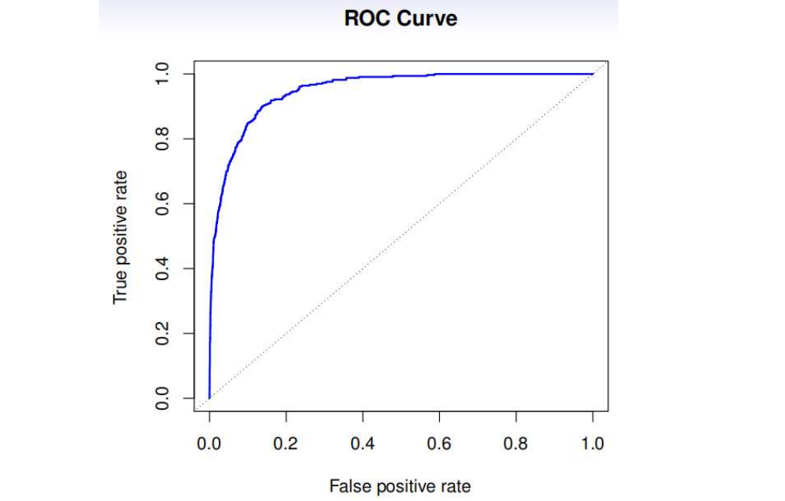

# 分类

## 4.0 基本问题

- 为什么定性变量的回归问题不能使⽤线性回归？
- 逻辑斯蒂函数表达形式以及对数发⽣⽐的构造？其含义？
- 估计系数的基本⽅法？
- 不使用逻辑斯蒂回归的原因？
- 线性判别分析实现的基本步骤？
- 贝叶斯分类器的分类结果如何表达？
- 灵敏度、特异度、召回率和精确度的计算？
- 为什么LDA的灵敏度这么低？
- ROC图像的基本使⽤？
- 第⼀类错误和第⼆类错误的区分？
- QDA在实现过程中和lda存在哪些不同？
- K近邻算法需要输⼊的多组参数有哪些？
- K值对分类的影响？

## 4.1 概述

在很多情况下，响应变量是定性的(qualitative)。

分类任务是，以特征向量X为输入，建立函数预测响应变量Y的取值。

通常，我们对 X 属于每一类的概率(probabilities)更感兴趣。

## 4.2 为什么线性回归不可用

- 在二元的情况下，线性回归是可以使用的，它的结果和后续要讨论的线性辨别分析(linear discriminant analysis, LDA)的结果一致。但是对两水平以上的定性响应变量，哑变量的方法不能任意推广。
- 同时，线性归回可能会产生小于0或大于1的概率。

> 如果我们对疾病类型编码，中风为1，发烧为2，休克为3。我们隐含假设了它们的顺序，并且有相同的间隔，这是没有道理的。

## 4.3 逻辑斯谛回归

### 4.3.1 逻辑斯谛模型

逻辑斯谛函数为：
$$
p(X) = \frac{e^{\beta_0+\beta_1X}}{1+e^{\beta_0+\beta_1X}}
$$
它的一个很好的性质是，结果只会在0和1之间。

我们整理一下上面的式子：
$$
\frac{p(X)}{1-p(X)}=e^{\beta_0+\beta_1X}
$$
${p(X)}/{1-p(X)}$ 被称为**发生比**，取值为0到无穷大，发生比越大概率越高。

类似的，对数发生比为：
$$
log  \left( \frac{p(X)}{1-p(X)} \right) =\beta_0+\beta_1X
$$
逻辑斯谛回 归模型可以视为分对数变换下关于X的一个线性模型。

### 4.3.2 估计回归系数

采用极大似然方法估计系数。即找到系数的估计，代到逻辑斯谛模型中，阳性的都为1，阴性的都为0，用数学表示就是：
$$
\ell(\beta_0,\beta_1)=\prod_{i:y_i=1}p(x_i)\prod_{i':y_{i'}=1}(1-p(x_{i'}))
$$
找到系数，让上面这个似然函数最大。

> 在线性回归下，最小二乘其实是极大似然的特例。

### 4.3.3 多元逻辑斯蒂回归

$$
P(X) = \frac{e^{\beta_0+\beta_1X_1+...+\beta_pX_p}}{1+e^{\beta_0+\beta_1X_1+...+\beta_pX_p}}
$$

> **混淆**现象：
>
> - 当我们单独用学生身份(student)预测default概率的逻辑斯谛回归模型的系数估计时，系数是正的。
> - 然而，结合balance、income、student三个预测变量建立的预测 default概率的逻辑斯谛回归模型的系数估计时，student的系数是负的。
>
> 原因在于：
>
> - 单独建模时，与非学生相比，学生拥有更高的违约概率。（因为更可能会持有大笔的信用卡债务）
> - 但是在给定信用卡债务时，学生违约概率更小。

### 4.3.4 响应分类数超过2的逻辑斯谛回归

$$
P(Y=k|X) = \frac{e^{\beta_{0k}+\beta_{1k}X_1+...+\beta_{pk}X_p}}{\sum_{i=1}^Ke^{\beta_{0i}+\beta_{1i}X_1+...+\beta_{pi}X_p}}
$$

## 4.4 线性判别分析LDA

不使用逻辑斯蒂回归的原因：

- 当类别的区分度高的时候，逻辑斯谛回归模型的参数估计 不够稳定，这点在线性判别分析中是不存在的。
- 如果样本量𝑛比较小，而且在每一类响应分类中预测变量 X 近似服从正态分布，那么线性判别分类模型比逻辑斯谛回 归模型更稳定。
- 响应分类多于两类时，线性判别分析应用更普遍。

### 4.4.1 运用贝叶斯定理进行分类

$$
Pr(Y=k|X=x) = \frac{\pi_kf_k(x)}{\sum_{i=1}^K \pi_i f_i(x)}
$$

- 其中，$\pi_k$ 是 观测来自第 k 类的先验概率。
- $f_k(x) \equiv Pr(X=x|Y=k)$，表示第 k 类观测的 X 的密度函数。
- $p_k(x)$ 是观测属于第 k 类的后验概率。

### 4.4.2 p=1的LDA

假设 $f_k(x)$ 正态且高斯，那么：
$$
f_k(x) = \frac{1}{\sqrt{2\pi}\sigma_k} \exp(- \frac{1}{2\sigma_k^2}(x-\mu_k)^2)
$$
再假设所有类别的 $\sigma_k$ 都相同，带入LDA，那么观测会被分类到下面的值取最大的类别中：
$$
\delta_k(x)=x\frac{\mu_k}{\sigma^2}-\frac{\mu_k^2}{2\sigma^2}+log\pi_k
$$
>  这里，判别函数$\delta_k(x)$是 x 的一个线性函数。这是线性判别分析中 **线性** 的由来。

因为：
$$
Pr(Y=k|X=x) = \frac{e^{\hat{\delta}_k(x)}}{\sum_{l=1}^K e^{\hat{\delta}_l(x)}}
$$
再假设 K=2 并且 $\mu_1=\mu_2=0.5$，那么贝叶斯决策边界(decision boundary)对应的点为：
$$
x=\frac{\mu_1+\mu_2}{2}
$$
符合我们的直觉。

我们如何估计 $\mu, \pi , \sigma$ ？
$$
\hat{\pi}_k= \frac{n_k}{n}
$$

$$
\hat{\mu}_k = \frac{1}{n_k}\sum_{i:y_i=k}x_i
$$

$$
\hat{\sigma_k^2}=\frac{1}{n_k-1}\sum_{i:y_i=k}(x_i-\hat{\mu}_k)^2
$$

$$
\hat{\sigma^2}
=\frac{1}{n-K}\sum_{k=1}^K\sum_{i:y_i=k}(x_i-\hat{\mu}_k)^2
=\frac{n_k-1}{n-K}\sum_{k=1}^K\hat{\sigma_k^2}
$$

$\hat{\sigma^2}$ 可以视为 K 类样本方差的加权平均，$\hat{\mu}_k$即为第 k 类观测的均值。

总结一下，LDA分类器的结果是建立在每一类观测都来源于一个均值不同，方差相同的正态分布假设上的。

### 4.4.3 p>1的LDA

LDA推广到多元：假设X=(X1 , X2 , …Xp )服从一个均值不同、协方差 矩阵相同的多元高斯分布。

多元高斯分布假设每一个预测变量服从一个一维正态分布且每两个有预测变量之间都存在一些相关性。

多元高斯分布密度函数和判别函数较复杂，略。

### 4.4.4 指标

- 灵敏度：正确判断阳性的比例
- 特异度：正确判断阴性的比例
- 假阳性率(False positive rate)：将阴性样本分类成为阳性样本的比例，即第二类错误，取伪
- 假阴性率(False negative rate)：将阳性样本分类成阴性样本的比例，即第一类错误，弃真

ROC(Receiver Operating Characteristic，接收者操作特征 曲线)曲线是一种常用的图像，它可以同时展示出真阳性率和假阳性率。

分类器的表现是通过ROC曲线下面的面积(area under the ROC curve, AUC)来表示的。 AUC越大，分类器越好。

### 4.4.5 二次判别分析QDA

前面讨论的p>1的LDA假设每一类观的 $f_k(x)$ 测服从一个多元高斯分布，其中协方差矩阵对所有的K类是相同的。

如果假设服从多元高斯分布，但每一类观测都有自己的协方差矩阵，则称作二次判别分析(quadratic discriminant analysis,QDA)

- 如果贝叶斯决策边界是线性的，那么LDA比QDA更加接近真实。
- 如果贝叶斯决策边界不是线性的，那么QDA比LDA更加接近真实。
- 如果训练观测数据量相对较少，LDA比QDA更好，因为LDA降低了模型的方差。

## 4.5 分类方法的比较

逻辑斯谛回归和LDA是紧密相连的。它与逻辑斯谛回归有相同的形式，两者只是在拟合（参数估计）过 程中有一些差异。

- 逻辑斯谛回归中参数是由极大似然估计出来的。
- LDA是通过估计的正态分布均值和方差计算出来的。
- LDA假设观测服从每一类协方都相同的高斯分布，当假设成立时，LDA能提供更好的结果
- 反之，协方都相同的高斯分布假设不成立时，逻辑斯谛回归更好。
- 当决策边界高度非线性时，KNN更好。
- 当响应分类多于两类，n较小或类差别明显且满足高斯假设时，线性判别分析应用更普遍。
