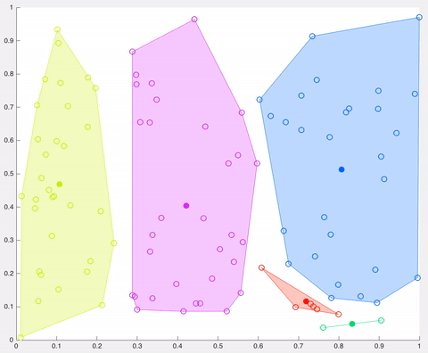

# 无指导学习

## 主成分分析

对于 $n \times p$ 的数据集 X 的第 i 个观测，第一主成分：
$$
z_{i1}= \sum_{j=1}^p \phi_{j1} x_{ij}
$$
如何解 $\phi$？
$$
\max_{\phi_{11}...\phi_{p1}}\{
\frac{1}{n} \sum_{i=1}^n z_{i1}^2
\},
\sum_{j=1}^p \phi_{j1}^2 = 1
$$
变量需要提前标准化

> 标准化，归一化，正则化
>
> - 归一化（Normalization）: 将一列数据变化到某个固定区间（范围）中， 通常， 这个区间是[0,1]
> - 标准化(Standardization): 将数据变换为均值为0，标准差为1的分布。
> - 正则化：例如在损失函数中加入的 L2 正则项。

每个主成分解释了多少？即方差解释比（PVE）：
$$
数据集总方差=\frac{1}{n} \sum_{j=1}^{p} \sum_{i=1} ^n x_{ij}^2
$$

$$
第m个主成分的方差解释比率= \frac{1}{n} \sum_{i=1}^n z_{im}^2
$$

$$
PVE=\frac{第m个主成分的方差解释比率}{数据集总方差}
$$

## 聚类分析（K means）

分了K个类 $C_1...C_k$，目标：
$$
\min_{C_1...C_k} \{
\sum_{k=1}^K W(C_k)
\}
$$
如何定义类内差异 $W(C_k)$ ？例如平方欧式距离：
$$
W(C_k)= \frac{1}{|C_k|} \sum_{i,i' \in C_k} \sum_{j=1}^p (x_{ij}-x_{i'j})^2
$$

1. K个质心是随机创建的（基于预定义的K值）
2. K-means将数据集中的每个数据点分配到最近的质心（最小化它们之间的欧几里德距离），这意味着如果数据点比任何其他质心更接近该群集的质心，则认为该数据点位于特定集群中。
3. 然后K-means通过获取分配给该质心集群的所有数据点的平均值来重新计算质心，从而减少与前一步骤相关的集群内总方差。K均值中的“均值”是指对数据求均值并找到新的质心。
4. 该算法在步骤2和3之间迭代，直到满足一些标准（例如最小化数据点与其对应质心的距离之和，达到最大迭代次数，质心值不变或数据点没有变化集群）

在该示例中，经过5次迭代之后，计算的质心保持相同，并且数据点不再交换集群（算法收敛）。这里，每个质心都显示为一个深色的数据点。
