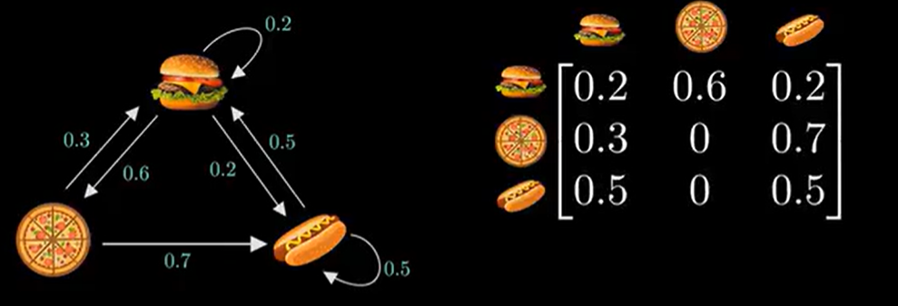
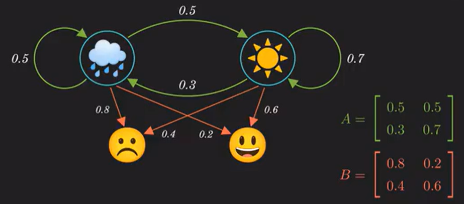
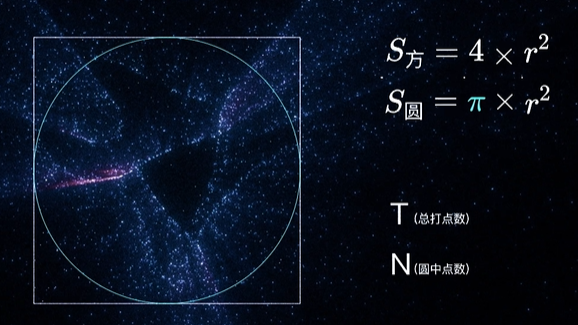
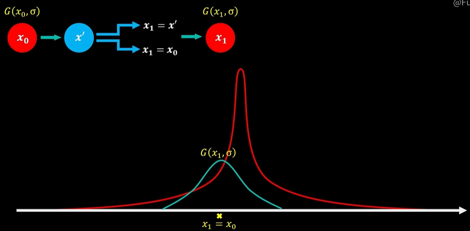
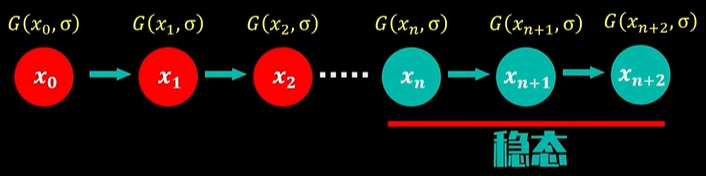

# 马尔科夫链和蒙托卡罗方法简明理解

X1,X2,⋯ 描述了一个状态序列，其中每个状态值取决于前一个状态。 $$X_t$$ 为随机变量, 称为时刻 t 的状态, 其取值范围称作状态空间。

马尔可夫链的数学定义为: 
$$
P(X_{t+1}∣X_t,X_{t−1},⋯,X_1)=P(X_{t+1}∣X_t)
$$
举个例子，假设每一天卖什么食物只有昨天卖什么食物有关，我们可以给出三种食物的转移概率，以及对应的邻接矩阵 A ：

我们使用 $$\pi$$ 这个行向量来代表三种食物在某一天提供的概率，举个例子，$$[0,1,0]$$ 代表这一天确定只提供披萨，其他两种食物不提供。

事实上，只要我们知道第一天食物的概率分布，我们就可以求得第 n 天的食物的概率分布：
$$
\pi_0A^n = \pi_n
$$

> 另一种理解 $$A^n$$ 的方法：第 i 行第 j 列的元素 $$A^n_{ij}$$ 代表了**第 i 个状态经过 n 次转移到达第 j 个状态的概率**。在满足某些条件的情况下，$$\lim_{n\to+\infty} A^n$$ 是稳定的。 

事实上，如果天数足够多，我们会发现，无论第一天食物的概率分布是怎样的，最后都会得到一个稳定的概率分布，换句话说，最后我们将得到：
$$
\pi A = \pi
$$
这个稳定的分布就是对于矩阵A，特征值为1对应的特征向量。

## 隐马尔可夫模型

什么是隐马尔可夫模型？举个例子，我们有晴天和雨天两种天气，并且今天的天气只和昨天的天气有关。小明有快乐和悲伤两种心情，对于晴天和雨天，小明两种心情出现的概率不同。

遗憾的是，因为我们在外地，我们观测不到天气，只知道小明的心情，并想要根据小明的心情去推测背后的天气。换句话说，隐马尔可夫模型就是**根据观测值计算观测不到的马尔可夫链**。

## 蒙特卡洛方法

蒙特卡洛方法是使用随机数获得近似结果的方法。

例如，我们可以用随机打点的方式计算圆周率：

我们把总打点数看作外接正方形的面积，园中点数看作内接圆的面积，只要随机打点的数目足够多，就能得到足够精确的圆周率：
$$
\frac{T}{N}=\frac{4}{\pi}
$$

## 马尔可夫蒙特卡洛方法

马尔可夫蒙特卡洛方法（MCMC）中蒙特卡洛发挥接受采样作用，马氏链则是找到蒙特卡洛中最为稳态的建议函数

假设我们要学习一个分布，如下图中的红线，我们先给出一个初始的近似分布G，如下图蓝线。

我们可以设计一个转移规则：

- 如果在G上（通过蒙特卡洛方法）采样得到的 x' 符合规则，则将新的分布G的均值 $$\mu$$ 设为 x'
- 如果在G上（通过蒙特卡洛方法）采样得到的 x' 不符合规则，则将新的分布G的均值不变

我们再采用马尔可夫链，当达到稳态时，就学习好了这个概率分布。

