$$
\Huge{计网课程笔记} \\
\small{by \quad QMMMS}
$$

[TOC]

# 引入（重要）

Computer network=  components ( host, switch, router, etc) + media + topology +protocol

topology：


protocols define format, order of msgs sent and received among network entities, and actions taken on msg transmission, receipt.

The Internet: the interconnected set of networks of the Internet Service Providers (ISPs) providing data communications services.

>   三大运营商：中国电信，中国移动，中国联通。
>
>   其他：中国教育和科研计算机网；长城宽带；北京电信通；东南网络；广电宽带 ；中国科技网（隶属于中国科学院计算机网络信息中心）

datagram network provides network-layer connectionless service：no call setup at network layer，packets forwarded using destination host address

Virtual circuit network provides network-layer connection service：“source-to-dest path behaves much like telephone circuit”

Circuit Switching，Packet Switching

Packet switching allows more users to use network! great for bursty data, resource sharing, simpler, no call setup. But excessive congestion: packet delay and loss, protocols needed for reliable data transfer, congestion control.

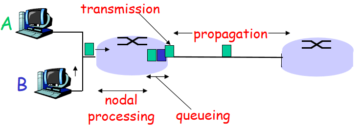

-   nodal processing: check bit errors determine output link.
-   queueing: time waiting at output link for transmission
-   Transmission delay: R=link bandwidth (bps) L=packet length (bits) time to send bits into link = L/R
-   Propagation delay:d = length of physical link s = propagation speed in medium (~2x108 m/sec) propagation delay = d/s

sum of four


## 五层协议栈

1.   **应用层（application）**为用户程序提供接口，协议包括HTTP，FTP，SMTP，DNS等等。应用层的信息分组称为**报文（message）**。
2.   **运输层（transport）**实现进程到进程的通信，包括TCP和UDP协议。分组称为**报文段（segment）**。
3.   **网络层（network）**实现主机间的通信，包括IP协议。分组称为**数据报（datagram）**。
4.   **链路层（link）**实现相邻节点间的数据传输，协议包括以太网，WiFi和电缆接入网的DOCSIS协议。分组称为**帧（frame）**。
5.   **物理层（physical）**完成物理介质上比特流的传输。包括铜线，电缆以及光纤的协议。


## OSI七层模型

1.   应用层。
2.   **表示层（presentation）**为不同终端的上层用户提供信息和数据的格式化方法。
3.   **会话层（session）**负责在网络中的两节点之间建立和维持通信。
4.   运输层。
5.   网络层。
6.   链路层。
7.   物理层。

## 设备归属

-   路由器（Routers），网络层（第三层）。
-   交换机（Switches），链路层（第二层）。
-   网桥（Bridges），链路层，功能与交换机相似，区别在于交换机多端口，网桥二端口。
-   转发器（Repeater），物理层（第一层）。两个端口，一入一出，对衰减的信号进行放大整形或再生，起到扩展网段距离的作用。
-   集线器（Hubs），物理层（第一层）。起数据转发和网络拓展作用。和交换机不同的是集线器是通过广播的方式传递数据。多个端口，一进，在其他端口同时出。


## 协议汇总

基于UDP：RIP，DNS，SNMP，DHCP。

-   **应用层**：HTTP，FTP，SMTP，POP3，IMAP，DNS，P2P，BitTorrent，SNMP。
-   **传输层**：UDP，ARQ，GBN，SR，TCP。
-   **网络层**：IP，DHCP，NAT，ICMP，RIP，OSPF，BGP，IGMP。
-   **链路层**：TDMA，FDMA，时隙ALOHA，ALOHA，CSMA，CSMA/CD，CSMA/CA，ARP。

## 单/广/组/任播

-   在**单播（unicast）**中，源主机对特定的主机进行数据传送。可以理解为一台机器和一台机器通信。
-   在**广播（broadcast）**中，主机对某一个网络上的所有主机发送数据包。
-   在**组播（multicast）**中，源主机只发送**一份**数据，数据的目的地址是组播组地址，属于该组的成员，都可以接收到一份源主机发送的数据的拷贝。
-   **多播**就是组播，英文都是multicast。
-   **任播（anycast）**，IPv6 增加的一种类型。任播的目的站是一组计算机，但数据报在交付时只交付其中的一个，通常是距离最近的一个。


## 局域网，城域网，广域网

**局域网（Local Area Network，LAN）**用于将有限范围内（例如一个实验室、一层办公楼或者校园）的各种计算机、终端互联成网。是封闭的内部（私有）网络，覆盖范围一般是方圆几千米之内。是链路层概念。两台电脑组成局域网只需要一根网线连接，多台电脑组成局域网只需要一个交换机，局域网和局域网互连才需要使用路由器。

**城域网（Metropolitan Area Network，MAN）**是在一个城市范围内所建立的计算机通信网。

**广域网（Wide Area Network，WAN）**又称广域网、外网、公网。是连接不同地区局域网或城域网计算机通信的远程网。通常跨接很大的物理范围，它能连接多个地区、城市，国家，洲，形成国际性的远程网络。广域网并不等同于互联网。一般所指的互联网属于一种公共型的广域网。

# 应用层

## HTTP

超文本传输协议（hypertext transfer protocol，HTTP），应用与Web，基于TCP，80端口。

HTTP is “stateless”：server maintains no information about past client requests

-   Nonpersistent HTTP：At most one object is sent over a TCP connection.
-   Persistent HTTP：Multiple objects can be sent over single TCP connection between client and server.

往返时间（Round-Trip Time，RTT）: time for a small packet to travel from client to server and back.


total = 2RTT+transmit time

two types of HTTP messages: request, response

小甜饼（Cookie）。保存User-server state在用户本地。


简述一下 Cookie 和 Session 的区别

- cookie 数据存放在客户的浏览器上，session 数据放在服务器上。
- cookie 不是很安全，别人可以分析存放在本地的 COOKIE 并进行 COOKIE 欺骗,考虑到安全应当使用session。
- session 会在一定时间内保存在服务器上。当访问增多，会比较占用你服务器的性能,考虑到减轻服务器性能方面，应当使用 cookie。
- 单个 cookie 保存的数据不能超过 4K，很多浏览器都限制一个站点最多保存 20 个cookie，而session则存储与服务端，浏览器对其没有限制
- session 会话机制：session 会话机制是一种服务器端机制，它使用类似于哈希表（可能还有哈希表）的结构来保存信息。 
- cookies 会话机制：cookie 是服务器存储在本地计算机上的小块文本，并随每个请求发送到同一服务器。Web服务器使用 HTTP 标头将 cookie 发送到客户端。在客户端终端，浏览器解析 cookie 并将其保存为本地文件，该文件自动将来自同一服务器的任何请求绑定到这些 cookie。

Web caches (proxy server)：Goal: satisfy client request without involving origin server

> 在访问某些网站时会被重定向，原因是请求头被自动修改，请求头是HTTP协议中的一部分。如要防止，简单来说就是阻止请求头被修改。
>
> 可以使用浏览器插件[Header Editor](https://he.firefoxcn.net/)，对于 bing.com ，之后在插件设置页添加新规则：
>
> | 标签     | 值                               |
> | -------- | -------------------------------- |
> | 名称     | （随便起一个名称，或者就叫Bing） |
> | 规则类型 | 修改请求头                       |
> | 匹配类型 | 正则表达式                       |
> | 匹配规则 | http(s?)://www\.bing\.com/(.*)   |
> | 执行类型 | 常规                             |
> | 头名称   | x-forwarded-for                  |
> | 头内容   | 8.8.8.8                          |

## FTP

文件传输协议（file transfer protocol，FTP），基于TCP实现。

-   控制连接（control connection）基于TCP端口21。是最初建立的连接，用于认证与传达命令。
-   数据连接（data connection）基于TCP端口20。在服务器的控制连接收到文件传输命令后建立，并在文件传输完成后关闭。

## SMTP

email has Three major components: 

-   user agents ：composing, editing, reading mail messagese.
-   mail servers ：mailbox contains incoming messages for user，have message queue of outgoing (to be sent) mail messages
-   simple mail transfer protocol: SMTP：protocol between mail servers to send email messages，client: sending mail server，“server”: receiving mail server


SMTP protocol uses TCP , port 25


SMTP: delivery/storage to receiver’s server

Mail access protocol: retrieval from server

-   第三版邮局协议（Post Office Protocol3，POP3）： . “Download-and-keep”: copies of messages on different clients. POP3 is stateless across sessions
-   因特网邮件访问协议（Internet Mail Access Protocol，IMAP）：  manipulation of stored msgs on server . keeps user state across sessions:
-   HTTP: gmail, Hotmail, Yahoo! Mail, etc.

## DNS

域名系统（Domain Name System，DNS）hostname to IP address translation

**Distributed, Hierarchical Database**


-   根DNS服务器
-   顶级域（Top-level domain ，TLD）DNS服务器：responsible for com, org, net, edu, etc, and all top-level country domains uk, fr, ca, jp.
-   权威DNS服务器：organization’s DNS servers, providing authoritative hostname to IP mappings for organization’s servers 

**DNS name resolution process**

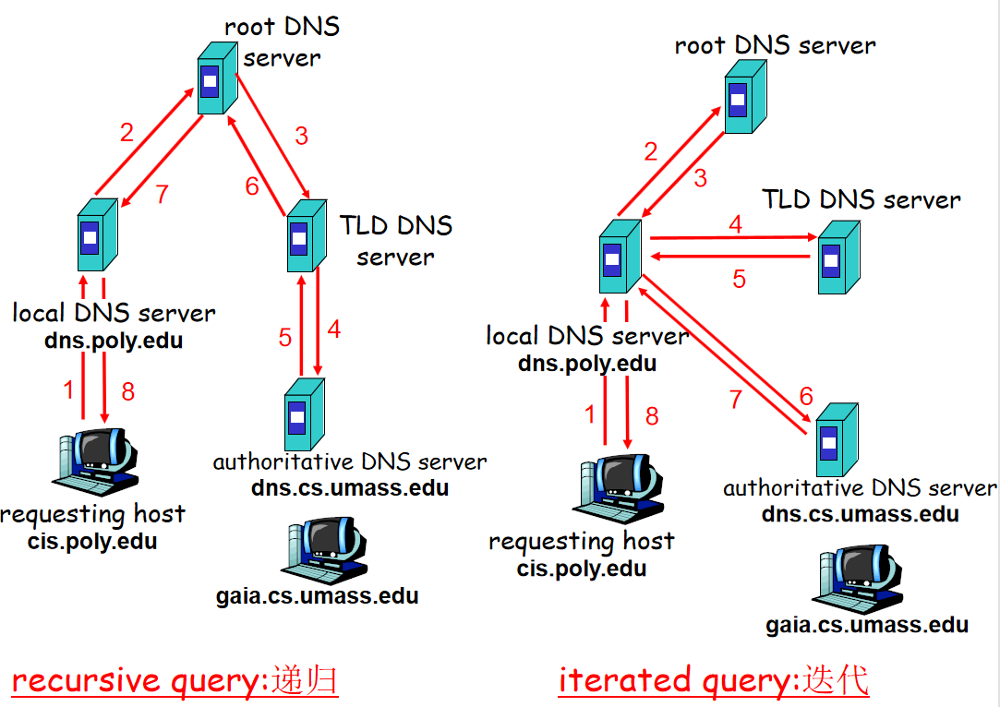

**DNS records**

resource records format: (name, value, type, ttl)

-   Type=A：name is hostname，value is IP address。如我们添加一条A记录将www的某个主机指向IP192.168.1.1，那么当你访问www主机时就会解析到192.168.1.1这个IP上。
-   Type=NS：name is domain (e.g. foo.com)，value is hostname of authoritative name server for this domain 用来指定该域名由哪个DNS服务器来进行解析。例如，假设我们有一个域名example.com，想要将其解析的权威域名服务器设置为ns1.exampledns.com，那么对应的NS记录将如下所示：`example.com.     IN    NS     ns1.exampledns.com.`
-   Type=CNAME：name is 别名 ，value is 规范主机名（example：name=`www.ibm.com`，value=`servereast.backup2.ibm.com`）
-   Type=MX：value is name of mailserver associated with name

## P2P

点对点（Peer-to-Peer ，P2P）

All nodes are both clients and servers，No centralized data source

Popular file sharing P2P Systems：Napster, Gnutella, Kazaa, Freenet

比特流（Bit Torrent）协议是架构于TCP/IP协议之上的一个P2P文件传输协议。

-   文件发布者会根据要发布的文件生成提供一个.torrent文件，即种子文件，也简称为“种子”。　　
-   BT种子，是一种电脑文件，大小在1-500KB左右，种子文件就是记载最终要下载的东西的存放位置、大小、下载服务器的地址、发布者的地址等数据的一个索引文件。
-   Tracker：收集下载者信息的服务器，并将此信息提供给其他下载者，使下载者们相互连接起来，传输数据。tracks peers participating in torrent
-   torrent: group of peers exchanging  chunks of a file
-   做种：发布者提供下载任务的全部内容的行为；下载者下载完成后继续提供给他人下载的行为。

Rarest First：Determine the pieces that are most rare among your peers, and download those first

Searching for Information in a P2P Community P2P社区上的搜索

-   Centralized Index 集中式管理
-   Query Flooding 查询洪水
-   Hierarchical Overlay 层次重叠

## SNMP

简单网络管理协议（Simple Network Management Protocol，SNMP），用于管理服务器和代表管理服务器执行的代理之间传递网络管理控制和信息报文。

## 补充案例

*CDN* (内容分发网络) 指的是一组分布在各个地区的服务器。这些服务器存储着数据的副本，因此服务器可以根据哪些服务器与用户距离最近，来满足数据的请求。

> [Stack Overflow](https://stackoverflow.com/)是国外一个与程序相关的IT技术问答网站，类似于国内的[segmentfault](https://segmentfault.com/)。然而打开Stack Overflow速度非常慢，如何解决？
>
> Stack Overflow为了加快网站的速度，都使用了 Google 的 CDN。 但是在国内，由于某些原因，导致全球最快的 CDN 变成了全球最慢的。将 Google 的 CDN 替换成国内的，就可以解决。例如在浏览器中安装[ReplaceGoogleCDN](https://github.com/justjavac/ReplaceGoogleCDN)插件

# 传输层

多路复用Multiplexing at send host:gathering data from multiple sockets, enveloping data with header (later used for demultiplexing)

多路分解Demultiplexing at rcv host:delivering received segments to correct socket

## UDP协议

尽力而为，无连接，不可靠，简单，首部开销小，支持广播和组播。


**检验和（checksum）**

1.   对于数据D，发送方计算所有数据16比特字的和，如果溢出则回卷（指加到最后一位）。
2.   求这个和的反码（就是将结果的0换成1，1换成0）。
3.   将数据与检验和发送给接收方。
4.   接收方将数据和检验和的所有16比特字加到一起，如果结果全为1，则正确，反之出错。

## 可靠传输原理（重要）

**可靠传输组件**

-   ACK（acknowledgements ）与NAK（negative acknowledgements）：向发送方反馈信息，某个分组是否被正确接收。
-   校验和（checksums）：检测分组比特差错。
-   序列号（sequence numbers）：检测数据包顺序差错与冗余数据包。
-   定时器（timers）：检测丢包问题。
-   窗口，流水线：允许发送方发送多个分组而不需等待确认。

**特殊情况处理**

-   累积确认（cumulative acknowledgement）。`ACK(n)`指接收方已经正确接收序号小于等于`n`的分组。如果发送方收到`ACK(120)`但没有收到`ACK(100)`，也认为序号100以及之前的数据被正确接收。
-   当超时事件发生后，超时间隔被设置为原来的两倍。
-   快速重传（fast retransmit）。当发送方接收到对相同数据的三个冗余ACK（duplicate ACK），在定时器过期之前立即重传之后的报文段。

>   对快速重传的解释：三个冗余ACK大概率是由于某个报文段丢失导致的，在之后的（乱序）报文段到达接收方之后，接收方会发出大量的冗余ACK。
>
>   为什么是三个而不是两个：两个冗余ACK也可能仅仅因为乱序导致，而不是丢失。必须说明对于冗余ACK原因的猜测是基于经验给出的，而不绝对。

## 停等协议与流水线协议

自动重传请求（Automatic Retransmission reQuest，ARQ）指在接收站接收到一个包含出错数据的信息（帧）时,自动发出一个重传错帧的请求。是OSI模型中数据链路层和传输层的错误纠正协议之一。它包括停止等待ARQ协议和连续ARQ协议。

stop and wait：Sender sends one packet, then waits for receiver response

流水线协议包括回退N步（Go-Back-N，GBN）协议和选择重传（Selective Repeat，SR），共同特点是允许发送方发送多个分组而不需等待确认，这是停等协议做不到的。

**时间使用率计算**

在一条数据传输速率为 1 Gbps的链路上，对于长度为 8000 bit分组，单向传播时延为 15 ms，计算停等协议与流水线协议（一次发三个包）的时间使用率。
$$
d_{trans}=\frac{L}{R}=\frac{8000 bit}{10^9 bps}=0.008ms
$$
停等协议：
$$
U_{sender}=\frac{L/R}{\text{RTT}+L/R}=\frac{0.008ms}{2\times15ms+0.008ms}=0.027\%
$$
流水线协议（一次发三个包）：
$$
U_{sender}=\frac{3\times L/R}{\text{RTT}+L/R}=\frac{0.024ms}{2\times15ms+0.008ms}=0.08\%
$$


**GBN协议**

-   接收方流水线中未确认的分组不能超过N个。
-   ACK采用累积确认（cumulative acknowledgement），`ACK(n)`指接收方已经正确接收序号小于等于`n`的分组。
-   对于超时，失序和出错，发送方需要重传所有“已发送，未确认”的分组。
-   窗口长度必须小于序号空间大小。

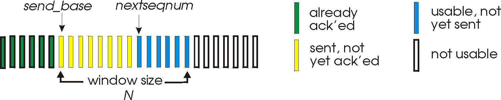

**SR协议**

-   只需要重传丢失和出错的包。不需要重传失序的包，失序的包将在接收方缓存。
-   因此`ACK(n)`仅指代接收方已经正确接收序号等于`n`的分组。
-   窗口长度必须小于等于序号空间大小的一半。（比如序号为0，1，2，3，窗口长度必须小于等于2）

问：卫星信道上数据传输速率为1Mb/s，数据帧长为1000bit，卫星信道的传播时延为270ms，而帧的控制信息、确认帧长及帧处理时间均可忽略不计。当采用下列三种协议时，试计算可能达到的信道利用率是多少？ A. stop-and-wait   B. Go-Back-N, WT(发送窗口大小) =6, WB=1; C. Select Repeat, WT =5 ,WB =5

答：
$$
信道利用率 = \frac{数据发送时间}  {数据发送时间 + 传播时延}
$$

$$
A信道利用率 =\frac{ 1000bit \div 1Mb/s}{ 1000bit \div 1Mb /s+270ms\times 2}=0.184842\%
$$

$$
B信道利用率 =\frac{ 1000bit \div 1Mb/s \times 6}{ 1000bit \div 1Mb/s +270ms\times 2}=1.109057\%
$$

$$
C信道利用率 =\frac{ 1000bit \div 1Mb/s \times 5}{ 1000bit \div 1Mb/s +270ms\times 2}=0.924214\%
$$

## TCP协议（重要）

传输控制协议（Transmission Control Protocol，TCP），基于连接的，提供可靠数据传输服务，流量控制（flow control），拥塞控制。

### 报文格式


### 三次握手

三次握手（Three way handshake），指建立TCP连接时客户端与服务器需要进行三次通信。

1.   客户端发送一个特殊的TCP报文，无数据，SYN字段置1，给出客户端初始seq序号。
2.   服务器发送一个特殊的TCP ACK报文，无数据，SYN字段置1，ACK字段置1，给出服务器初始seq序号。
3.   客户端发送普通的TCP ACK报文。


### 四次挥手

四次挥手，指关闭TCP连接时客户端与服务器需要进行两次通信。（双向关闭）

1.   如果客户端想要关闭与服务器的TCP连接，客户端发送一个特殊的TCP报文，无数据，FIN字段置1。
2.   服务器发送普通的TCP ACK报文。
3.   如果服务器想要关闭与客户端的TCP连接，服务器发送一个特殊的TCP报文，无数据，FIN字段置1，ACK字段置1。
4.   客户端发送普通的TCP ACK报文。并开启定时器。
5.   客户端定时器结束后什么也不做。


>   如果是单方向的关闭：
>
>   1.   如果客户端想要关闭与服务器的TCP连接，客户端发送一个特殊的TCP报文，无数据，FIN字段置1。
>   2.   服务器发送普通的TCP ACK报文。并开启定时器。
>   3.   服务器定时器结束后什么也不做。
>
>   补充：
>
>   -   定时器的作用是：如果ACK报文丢失了，定时器结束前客户端会再发一次关闭请求，服务器再发一次ACK。如果定时器正常结束，则可以推断出一切正常。
>   -   这是单方向的关闭，即客户端不再向服务器发送数据（但是ACK还能发）。服务器端还得再来两次挥手才能双向关闭。
>
>   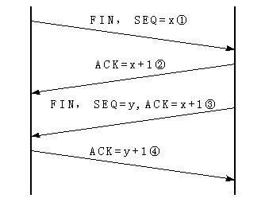

### seq与ACK序号计算


>   答案：M+100，M+100，M+350


>   答案：M+100，N+500


>   答案：5096

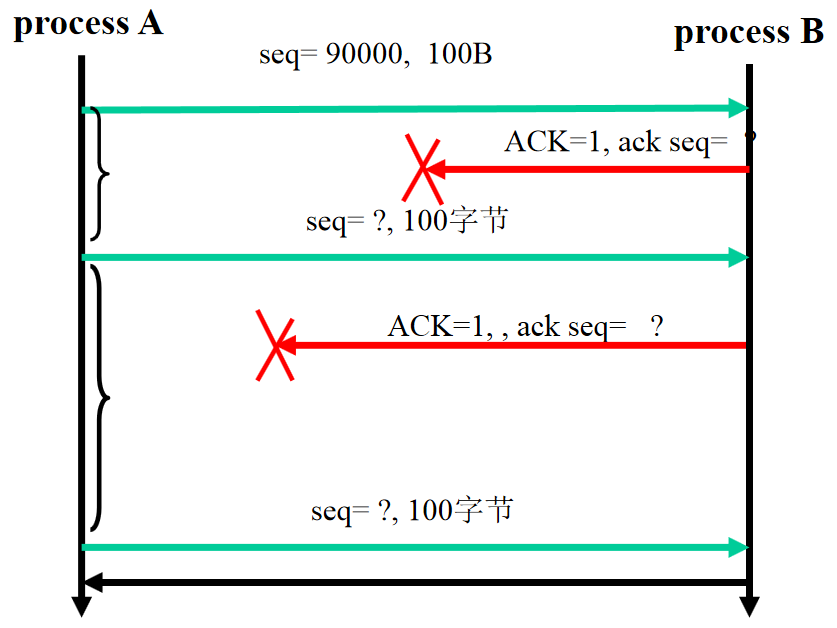

>   答案：90100，90000，90100，90000


>   答案：M，350，M+350

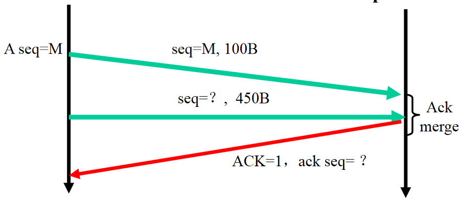

>   答案：M+100，M+550

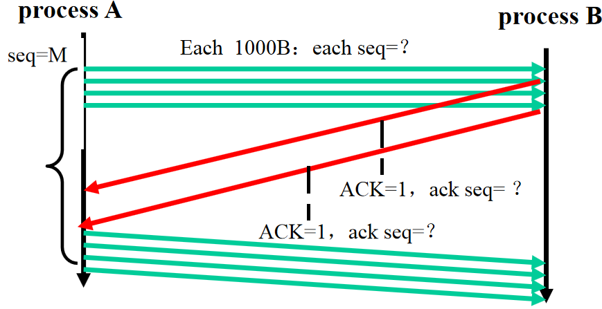

>   答案：M，M+1000，M+2000，M+3000，M+2000，M+4000

**综合**

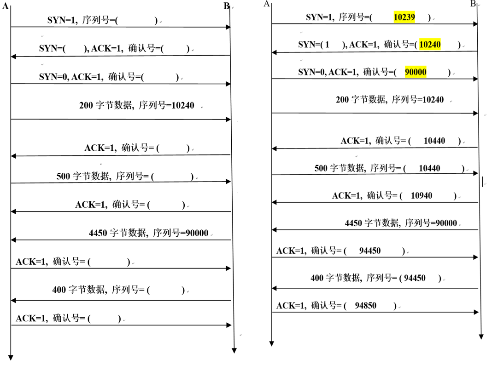

>   ACK回答一般不占seq序列号，带有SYN=1与FIN=1的ACK回答例外。


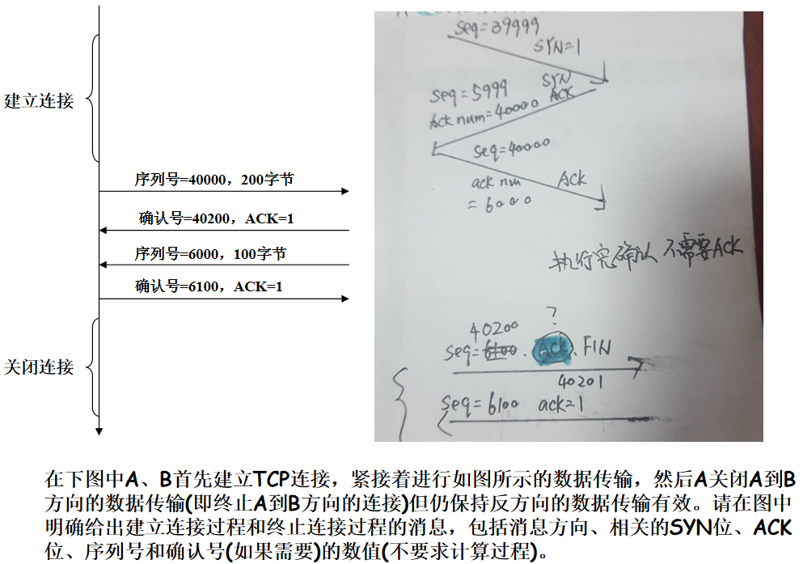

### 估计RTT

$$
\text{EstimatedRTT} = (1- \alpha )\times \text{EstimatedRTT} + \alpha \times \text{SampleRTT}
$$
使用了指数加权平均（exponential weighted moving average，EWMA）。

### 流量控制

流量控制（flow control）将发送方的发送速率与接收方应用程序的读取速率向匹配，来防止接收方缓存溢出。


接收方可以将缓存余量放入报文段中发给发送方，发送方保证发送的数据量不会使缓存溢出。

当缓存余量为0时，发送方发送只有一个字节数据的报文段（而不是什么都不做！），来让接收方返回更新后的缓存余量。

### 拥塞控制

拥塞控制（congestion control）在网络拥塞时调整发送方的发送速率来避免拥塞。以下图为例，包含几个部分：


-   慢启动（slow-start）。cwnd从一个MSS开始，如果没有丢包，cwnd在到达ssthresh前每过一个RTT翻倍。
-   拥塞避免（congestion avoidance）。cwnd在到达以及超过ssthresh后，每过一个RTT，cwnd增加一个MSS。
-   超时后将ssthresh设置为当前cwnd的一半，然后将cwnd设置为1，开始慢启动阶段。
-   上图中蓝色的线，即TCP早期版本 Tahoe，在收到三个冗余ACK后使用快速重传，再将ssthresh设置为当前cwnd的一半，然后将cwnd设置为1，再次开始慢启动阶段。
-   快速恢复（fast recovery）。上图中黑色的线，即TCP较新版本 Reno，在收到三个冗余ACK后使用快速重传，再将ssthresh设置为当前cwnd的一半，然后将cwnd设置为ssthresh，直接开始拥塞避免阶段。

其中的术语速查：

-   cwnd：拥塞窗口（congestion window，cwnd）。
-   MSS：最大报文段长度（Maximum Segment Size，MSS），一般为最大链路层帧长度。
-   ssthresh：慢启动阀值（slow-start threshold）。
-   RTT：往返时间（Round-Trip Time，RTT），指一个**短**分组从客户到服务器再返回客户的时间。

additive increase: increase  CongWin (congestion window) by 1 MSS (Maximum Segment Size )every RTT until loss detected MSS=MTU-IP-TCP 

multiplicative decrease: cut CongWin in half after loss 

>   问：有一个TCP连接,当它的拥塞窗口大小为64个分组大小时超时，假设该线路往返时间RTT是固定的即为3s，不考虑其他开销，即分组不丢失，该TCP连接在超时后处于慢开始阶段的时间是多少秒? 
>
>   答：当超时的时候,ssthresh变为cwnd大小的一半，即$ssthresh=64 \div 2=32$，此后cwnd重置为1，再次开始慢启动算法｡经过5个RTT，拥塞窗口大小变为$2^5=32$达到ssthresh。此后便改用拥塞避免算法。因此，该TCP连接在超时后重新处于慢开始阶段的时间是$5\times RTT=15s$｡

## Socket

Socket是一种在计算机网络中用于通信的抽象概念。它实际上是一个应用程序接口（API），允许不同的计算机进程在网络上进行通信。Socket允许在网络中的两个节点之间建立连接，并通过该连接发送和接收数据。

在网络编程中，Socket通常表示为IP地址和端口号的组合，用于标识网络中的特定通信节点。它可以基于不同的传输协议，如TCP（传输控制协议）或UDP（用户数据报协议），来进行数据的可靠或不可靠传输。

创建socket（指定TCP还是UDP、IP地址和端口号），然后通过它收发数据。

# 网络层（数据平面）

## 路由器

**功能**

-   run routing algorithms/protocol (RIP, OSPF, BGP)
-   forwarding datagrams from incoming to outgoing link

**组件**

-   输入端口：线路端接；数据链路处理；查找转发排队。
-   交换结构：经过内存，总线，或者交互网络（crossbar）交换
-   输出端口：（同输入端口）
-   路由选择处理器

**分组调度（Packet Scheduling）**

-   FCFS（first come, first served）: packets transmitted in order of arrival to output port，also known as: First-in-first-out (FIFO) 
-   priority：send packet from highest priority queue that has buffered packets，FCFS within priority class
-   循环排队（round robin）：server cyclically, repeatedly  scans class queues, sending one complete packet from each class (if available) in turn
-   加权公平排队（Weighted Fair Queuing ，WFQ）：each class, i, has weight, wi, and gets weighted amount of service in each cycle:$\frac{w_i}{\sum w_j}$

>   线路前部阻塞（Head-of-the-Line ，HOL）blocking: queued datagram at front of queue prevents others in queue from moving forward

>   网关（Gateway）又称网间连接器、协议转换器。在传输层上以实现网络互连，常用来连接两种不同的网络，在不同网络协议间充当翻译角色。

## 五类网络（重要）

-   A类网络，0.0.0.0 至 127.255.255.255。网络号（Netid）前8位，主机号（Hostid）后24位。以`0`开头。
-   B类网络，128.0.0.0 至 191.255.255.255。网络号前16位，主机号后16位。以`10`开头。
-   C类网络，192.0.0.0 至 223.255.255.255。网络号前24位，主机号后8位。以`110`开头。
-   D类网络，224.0.0.0 至 239.255.255.255。不分网络号和主机号。以`1110`开头。用于组播与IGMP协议。
-   E类网络，240.0.0.0 至 255.255.255.255。不分网络号和主机号。以`1111`开头。保留。

>   补充：
>
>   **回环（loopback）地址**，127.0.0.0 至 127.255.255.255。
>
>   127.0.0.1是保留地址之一，经常被使用，来检验本机TCP/IP协议栈工作是否正常。如果可以ping通的话，就说明本机的网卡和IP协议安装都没有问题。（跟当前主机有没有联网没有关系）
>
>   **私有（private）IP地址**，用于本地局域网，通过NAT协议转换：
>
>   -   10.0.0.0  至 10.255.255.255
>   -   172.16.0.0 至 172.31.255.255
>   -   192.168.0.0 至192.168.255.255

**分配子网**

如果一个主机的IP为202.112.41.241，掩码为255.255.255.224，给出其网络号和主机号，并计算最多分配多少子网。

掩码共27位，网络号为202.112.41.241的前27位，即202.112.41.224，主机号为后面5位，即0.0.0.17。202.112.41.241在C类网络中，本来的掩码是24位，多出来的3位掩码可以分配子网，共8个：202.112.41.0； 202.112.41.32； 202.112.41.64；   202.112.41.96； 202.112.41.128； 202.112.41.160；   202.112.41.192； 202.112.41.224；

**CIDR/VLSM**

域内无分类编址（Classless InterDomain Routing，CIDR）

-   subnet portion of address of arbitrary length: 可变长子网掩码（Variable Length Subnet Masking ，VLSM）
-   address format: a.b.c.d/x, where x is # bits in subnet portion of address

**空间利用率**

一个网段上需要连接最多8740台计算机设备，若对其分配IP地址,问A、B、C哪一类地址最合适（1分），并写出对应的子网掩码（1分）? 如果采用无分类域间编码，写出子网掩码（1分）。这两种情况下，地址空间利用率分别为多大（2分）？

$2^{13}<8740<2^{14}$，主机位必须大于等于14位，掩码长必须小于等于18位，B类地址最合适，子网掩码为255.255.0.0。采用无分类域间编码，子网掩码为255.255.192.0。

若采用B类地址，$利用率=\frac{8740}{2^{16}-2}=13.33\%$
若采用无分类域间编码，$利用率=\frac{8740}{2^{14}-2}=53.35\%$

## IPv4（重要）

**IPv4格式**


具体看图，几个注意点如下：

-   头长度为20字节至60字节。因为首部信息的前20字节必须存在，选项（Option）部分是可选的，0字节至40字节。在考试大题中，如果没有说明，默认头长度为20字节。
-   头长度（head len）用4个比特标识。4个比特可以表示的范围是0~15，在乘4得到头长度字节数。如果4个比特为`1111`，$头长度=15\times 4=60字节$。如果4个比特为`0101`，$头长度=5\times 4=20字节$。
-   总长度（Total length）包括头长度与数据，以字节计，因为该字段长16比特，所以IP数据报的理论最大长度为65535字节。（虽然IP数据报长度很少超过1500字节）

**IPv4分片**

一个链路层帧能承载的最大数据量叫**最大传送单元（Maximum Transmission Unit，MTU）**。IPv4分片（fragmentation）将过大的IP数据报中的数据分割为几个较小的片（fragment）供链路层传输。

这些片头信息中，源地址，目的地址，标识号都应该是相同的。需要改变长度（length），标志比特（fragflag）与偏移量（offset）。

-   长度（length）：包含头在内的总长度。
-   标志比特（fragflag）：最后一个片的标志比特设置为0，其他片设置为1。
-   偏移量（offset）：指定该片应该放在原始IP数据报的数据中哪个位置。

IPv6不允许分片，丢弃太大的数据报并且向发送方发回一个“分组太大”的ICMP报文。

例子：对于一个4000字节的数据报，要在一条MTU为1500字节的链路上传播，如何分片？

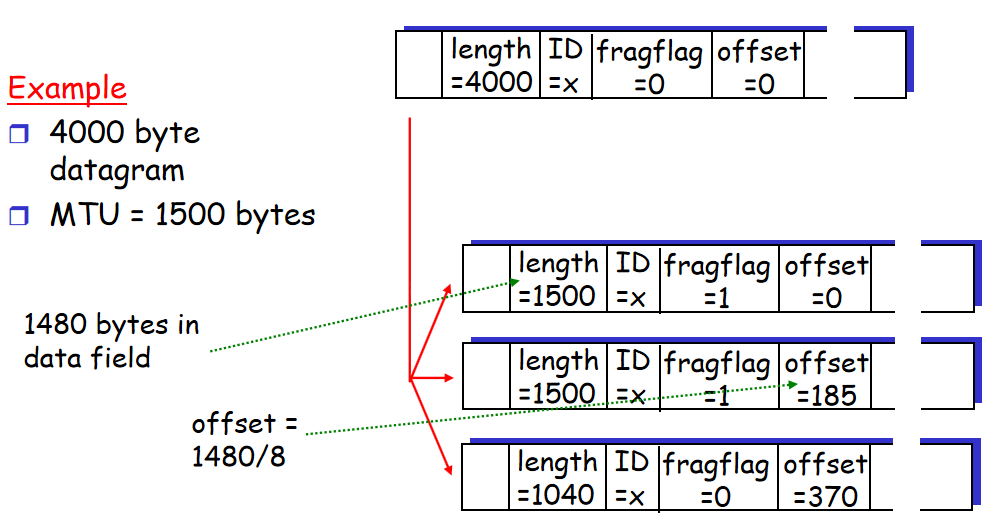

解释：

-   如果没有明确给出，头长度为20比特。
-   偏移量需要除以8，因为每个分片的长度一定是8字节的整数倍。如果MTU减去头长度不能被8整除，下取整。

## DHCP

动态主机配置协议（Dynamic Host Configuration Protocol，DHCP）allow host to dynamically obtain its IP address from network server when it joins network

1.   DHCP discover：host broadcasts “DHCP discover” msg
2.   DHCP offer：DHCP server responds with “DHCP offer” msg
3.   DHCP request：host requests IP address: “DHCP request” msg
4.   DHCP ACK：DHCP server sends address: “DHCP ack” msg.DHCP返回的不仅仅是IP地址，还包括了：（1）客户的第一跳路由器（可能是网关）的地址。（2）DNS服务器的IP地址和域名。（3）网络掩码（用于指示网络的网络号部分和主机号部分）。

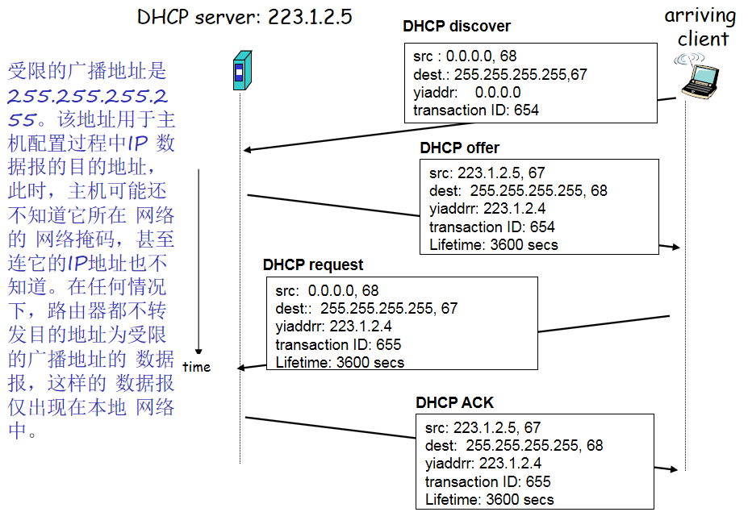

>   Q: How does an ISP get block of addresses?
>
>   A: 互联网名称与数字地址分配机构（Internet Corporation for Assigned Names and Numbers，ICANN） allocates addressesmanages DNSassigns domain names, resolves disputes

## NAT

网络地址转换（Network Address Translation，NAT）把内部私有IP地址翻译成合法外部网络IP地址的技术。

-   NAT是作为一种解决IPv4地址短缺以避免保留IP地址困难的方案而流行起来的。
-   local network uses just one IP address as far as outside world is concerned
-   devices inside local net not explicitly addressable, visible by outside world (a security plus)


NAT traversal穿透   various methods employed to set up and maintain a TCP/IP network or UDP connections that cross NAT gateways. 

## IPv6（重要）

**IPv6格式**


**IPv6与IPv4区别**

-   IPv4地址长32比特，使用点分十进制，IPv6地址长128比特，使用8组，每组4个十六进制数来表示，即冒号十六进制记法（colon hexadecimal notation）
-   IPv6地址可以使用零压缩（zero compression）简化表示，即一连串连续的零可以为一对冒号所取代。
-   IPv4头长度可变（20字节至60字节），IPv6头长度固定40字节。
-   IPv6基本首部不支持分片，首部信息也没有检验和与选项字段。
-   IPv6增强了对进一步扩展，安全，任播，服务质量（Quality of Service，QoS）的支持。
-   IPv6 把原来 IPv4 首部中选项的功能都放在扩展首部中，并将扩展首部留给路径两端的源站和目的站的主机来处理。数据报途中经过的路由器都不处理这些扩展首部（只有一个首部例外，即逐跳选项扩展首部）。这样就大大提高了路由器的处理效率。
-   六种扩展首部： 逐跳选项，路由选择，分片，鉴别，封装安全有效载荷，目的站选项。 


## ICMP

因特网控制报文协议（Internet Control Message Protocol，ICMP），used by hosts & routers to communicate network-level information。

ping程序，traceroute程序的基础。

从封装来说，ICMP封装在IP中，属于传输层。从功能来说，为网络层服务。考试时答网络层。

```
Type  Code  description
0        0         echo reply (ping)
3        0         dest. network unreachable
3        1         dest host unreachable
3        2         dest protocol unreachable
3        3         dest port unreachable
4        0         source quench (congestion control - not used)
8        0         echo request (ping)
9        0         route advertisement
10      0         router discovery
11      0         TTL expired
12      0         bad IP header
```

# 网络层（控制平面）

## 路由表（重要）

一个简化的路由表包含以下五个属性：

1.   目标网络IP地址（destination）
2.   目标网络子网掩码（mask）
3.   下一站IP地址（next hop），直连用C表示
4.   离出接口名（interface）
5.   代价（cost），不同协议的代价定义是不同的


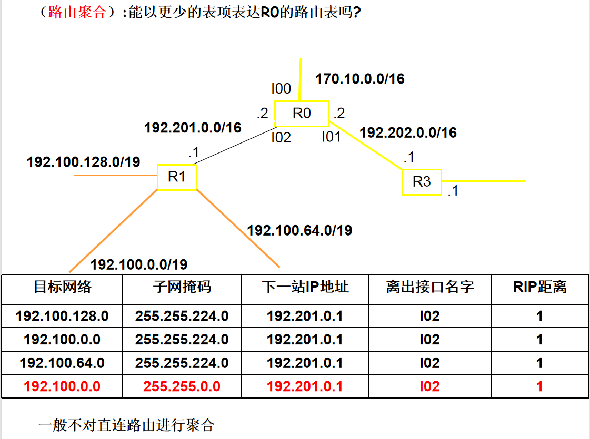

上面两张路由表的cost直连为0，准确来说是经过中转路由器的个数。（考试中直连默认为零，如果没明确给出的话）

**掩码处理方法**

对于如下路由表项：

| destination   | mask            | next    |
| ------------- | --------------- | ------- |
| 128.30.33.128 | 255.255.255.128 | inter 1 |

对于一个到达路由器的数据报（datagram），它的目的主机IP为128.30.33.138。

首先将目的主机IP与掩码做**与运算**。
$$
\begin{align}
&128.030.033.138 \\
&255.255.255.128 \\
&——————— \\
&128.030.033.128
\end{align}
$$
与destination中的表项符合，匹配成功，向下一站转发。

**最长匹配原则**

最长匹配原则指对于多个前缀匹配项，路由器选择前缀最长的匹配项，并向对应接口转发分组。

在具体实现上，在路由器构建路由表时，将掩码较长的项放在前面，所以在分组到来时，从上向下寻找，找到一个就向对应接口转发，不遍历整张表。

## 路由选择算法分类

-   集中式路由选择算法（centralized routing algorithm）。路由器知道全局的，完整的网络知识，来计算源与目的地之间的最低开销路径。对应链路状态（link state，LS）算法，对应最短路径优先路由协议OSPF（Open Shortest Path First）。
-   分散式路由选择算法（decentralized routing algorithm）。每个节点只知道与其直连的链路开销知识，通过迭代计算过程以及和相邻节点交换信息计算最低开销路径。对应距离向量（distance vector, DV）算法，对应路由信息协议RIP ( Routing Information Protocol)。
-   静态路由选择算法（static routing algorithm）。需要人工进行配置路由。
-   动态路由选择算法（dynamic routing algorithm）。周期性运行或直接响应链路开销变化自动配置路由。

>   以上是书上内容，ppt上还补充了：
>
>   1.   静态vs动态。静态路由优先级最高，高于动态路由。
>   2.   单路径vs多路径。多路径指到达同一目的地的同时走多条路径，可以实现数据流量的多路复用。路径路由算法可以提供更大的数据吞吐量，同时增强了网络的可靠性。
>   3.   单层结构vs分层结构。在单层次的路由系统中，所有的路由器都是对等的；在分层路由系统中，存在主干路由器，任何两台非主干路由器通信必须通过主干路由器传递。
>   4.   域间vs域内。有些路由算法只能在单独的域中使用；另外一些路由算法则既可以在域间也可以在域内使用，缓解随着网络规模增长带来路由表增大的问题。
>   5.   链路状态vs距离向量。

## 静态路由

静态路由固定了路径的转发，网络发送变化时需要人工进行配置修改。其特点包括：

1.   静态路由固定了路径的转发，因此对路由器的路由选择进行控制，节省了网络带宽，减少了额外开支。
2.   静态路由是单向的，它只设定了从此路由设备转发到目标出去的路径。
3.   静态路由缺乏灵活性，网络发送变化时需要人工进行配置修改。

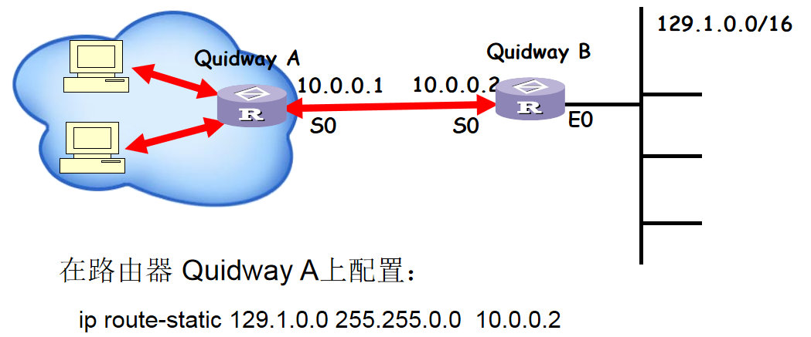

## 链路状态算法（重要）

链路状态（link state，LS）算法，本质上是用Dijkstra算法找到最短路径，会画表就行。


LS算法可能出现的问题：震荡。指在某一时刻所有路由都向开销最小的链路发送数据报，报使得该链路开销剧增，下一时刻所有路由都避免向该链路发送数据报，使得该链路开销剧减，以此循环。解决方法之一是随机化每台路由器发送链路通告的时间。

## 距离向量算法

距离向量（distance vector, DV）算法，本质上是用贝尔曼-福特（Bellman-Ford）算法（对于这个算法的详细讨论，证明以及实现，各种[算法书](https://gitee.com/QMMMS/reading-notes/blob/main/%E3%80%8A%E7%AE%97%E6%B3%95%20,4e%E3%80%8B(Java)/qms_59_BellmanFordSP.java)上都有）找到最短路径。这个算法的本质是：
$$
d_x(y) = \text{min}_v\{c(x,v) + d_v(y)\}
$$

-   其中，$d_x(y)$指x到y的最短路径。
-   v是x的邻居。
-   $c(x,v)$是x到v的直连链路开销。

举个例子，还是上面那个图，如果要计算$d_u(z)$：
$$
\begin{align}
d_u(z) &= \min \{ c(u,v) + d_v(z),
                    c(u,x) + d_x(z),
                    c(u,w) + d_w(z) \} \\
        &= \min \{2 + 5,
                    1 + 3,
                    5 + 3\}    \\
        &= 4
\end{align}
$$
如果$v^*$是令$D_x(y)$取得最小值的邻居，则x要向y发送数据报时，先发给$v^*$。

当x的距离向量更新了，则x将更新后的距离向量传给它的邻居，让邻居更新。

DV算法的特点包括：

-   开销减少的好消息传递得很快，指开销减少的路由表更新可以在较少的迭代次数后传递给所有路由器，或者说收敛速度快。
-   开销增大的坏消息传递得很慢，指开销增大的路由表更新需要较多的迭代次数才能完成。这会导致**路由选择环路（routing loop）**，即在路由表更新完成之前，为了到达目的地x，源y先把数据报发给z，z再发给y，来回反复直到路由表更新完成才能找到正确路径。为了解决路由选择环路，可以采用**毒性逆转（Poison Reverse）**和**触发刷新（Triggered Update）**。
    -   毒性逆转（poisoned reverse）。如果z通过y路由到达目的地x，则z通告y，z到x的距离是无穷大。
    -   触发刷新（Triggered Update）。一旦检测到路由崩溃，立即广播路由刷新报文，而不等到下一刷新周期。显然可以加快新路由的有效刷新。

>   补充：**路由算法评价标准**
>
>   -   最优性。指路由算法选择最佳路径的能力
>   -   低开销。最大程度的降低软件和使用开销（比如说报文数量与复杂度Message complexity）
>   -   聚敛速度（Speed of Convergence）。当因为某种原因使路由器出现问题而无法继续正常使用时，路由器会发出路由更新信息传遍整个网络，重新计算最优路径，并最终使所有路由器就新路径达成一致。 
>   -   适应性或健壮性（Robustness）。能够快速准确的适应不同的网络环境。路由算法应当能够通过编程，适应网络带宽，网络时延等参数变量的变化。

## 层次路由

层次路由（Hierarchical Routing）是一种网络路由的结构化方案，将网络划分成若干个层次和区域。这些区域称为自治系统（autonomous systems，AS），每个自治系统内使用统一的路由协议进行路由控制。

自治系统（Autonomous System，AS）是指由一组路由器及其连接的网络组成的单个管理域，这个管理域通常被视为一个独立的单位，有着自己独立的路由策略和自治能力。在自治系统内部，使用统一的路由协议进行路由控制，在自治系统之间，使用BGP（边界网关协议）来实现与其他自治系统之间的路由器通信。

自治系统内部使用的协议，称为内部网关协议（Interior Gateway Protocol，IGP），或者intra-AS routing protocol。包括路由信息协议RIP、最短路径优先路由协议OSPF。

自治系统之间使用的协议，称为外部网关协议（Exterior Gateway Protocol，EGP），或者inter-AS routing protocol。包括边界网关协议BGP。


## RIP协议（重要）

路由信息协议( Routing Information Protocol，RIP )，基于距离向量（distance vector, DV）算法。关于距离度量（distance metric），如果采用hop，直连为0。（考试中直连默认为零，如果没明确给出的话）

每30秒，距离向量通过响应信息（Response Message， 或者 advertisement）在邻居间交换。

从封装来说，RIP封装在UDP端口520中，属于应用层。从功能来说，为网络层服务。考试时答网络层。

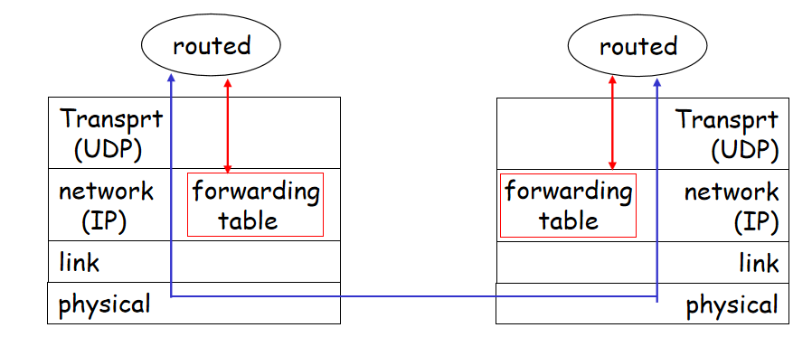

下图是报文格式，看看就行。


**路由表更新策略**

1.   如果目的地不存在，则加入路由表。
2.   对于相同目的地x，新旧cost来自不同路由器，$d(x) = \min\{old\_cost,new\_cost+1\}$，因为new_cost是邻居路由器$G_j$的，从本地到达还要加1。
3.   对于相同目的地x，新旧cost来自相同路由器$G_j$。如果目的地不可达，则删除目的地表项；如果有更新的new_cost，$d(x) = new\_cost+1$。

举个例子：

表一为原来的$G_i$路由表：

| Destination | cost | next  |
| ----------- | ---- | ----- |
| 10.0.0.0    | 0    | 直连  |
| 30.0.0.0    | 7    | $G_n$ |
| 40.0.0.0    | 3    | $G_j$ |
| 45.0.0.0    | 4    | $G_L$ |
| 180.0.0.0   | 5    | $G_j$ |
| 190.0.0.0   | 10   | $G_m$ |
| 199.0.0.0   | 6    | $G_j$ |

表二是来自路由器$G_j$的更新：

| Destination | cost |
| ----------- | ---- |
| 10.0.0.0    | 4    |
| 30.0.0.0    | 4    |
| 40.0.0.0    | 2    |
| 41.0.0.0    | 3    |
| 180.0.0.0   | 5    |

现在要给出更新后的$G_i$路由表，如下：

| Destination | cost | next  |
| ----------- | ---- | ----- |
| 10.0.0.0    | 0    | 直连  |
| 30.0.0.0    | 5    | $G_j$ |
| 40.0.0.0    | 3    | $G_j$ |
| 41.0.0.0    | 4    | $G_L$ |
| 45.0.0.0    | 4    | $G_j$ |
| 180.0.0.0   | 6    | $G_j$ |
| 190.0.0.0   | 10   | $G_m$ |

## OSPF协议

OSPF协议，全称开放最短路径优先路由（Open Shortest Path First）协议。基于链路状态（link state，LS）算法。OSPF消息是封装在IP数据报中的，因此从封装来说，OSPF属于传输层。从功能来说，为网络层服务。考试时答网络层。

**OSPF相较与RIP的区别**

-   安全。可以鉴别（authenticated）OSPF报文的真实性。
-   允许存在多条相同开销的路径。
-   对单播与多播的综合支持。
-   支持层次路由结构。

层次OSPF的示意图如下，看看就行。


## BGP协议

BGP协议，全称边界网关协议 (Border Gateway Protocol)。BGP报文被封装在TCP报文段中传输，因此从封装来说，属于应用层。从功能来说，为网络层服务。考试时答网络层。

提供以下功能：

-   从邻居AS获取获得前缀（或者说子网）可达性信息，并且向因特网的其他部分通告它（子网）的存在。
-   基于可达性信息与策略，确定到达某个子网的最佳路由。

跨越两个AS的BGP连接称为外部BGP（External Border Gateway Protocol，eBGP）。在相同AS中的两台路由器之间的会话称为内部BGP（Internal Border Gateway Protocol，iBGP）。示例图如下：

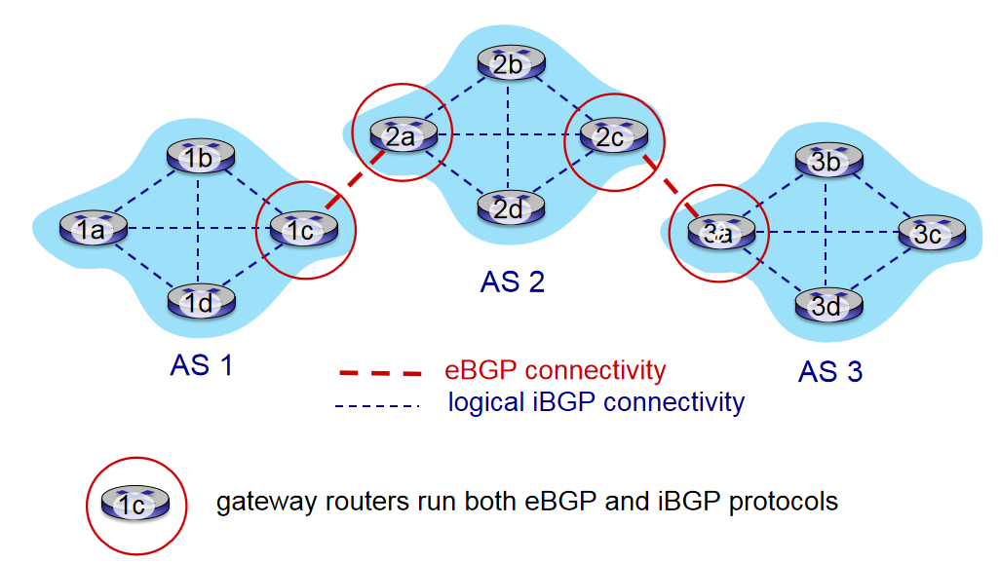

**热土豆路由选择**

BGP允许存在到某个前缀（子网）的多条路径（使用`下一站接口IP；AS路径；前缀`三个信息来标识一条路径）。那么在选择一条具体路径时，可以使用热土豆路由选择（hot potato routing）。它是一种BGP路由选择算法。


热土豆路由选择的思想是：将分组以最低开销送出其AS。

举个例子，在上面这个图中，在AS2中，如果要将分组送往x：

-   对于2a路由器，它会将分组先送往1c。
-   对于2c路由器，它会将分组先送往3a。

>   **不同协议的讨论（补充内容看看就行）**
>
>   有了IGP为什么要有iBGP？有了iBGP为什么要有IGP？
>
>   1.   IGP的能力限制。IGP处理路由的条目有限，BGP的路由控制能力大大强于IGP的路由控制能力。
>   2.   路由环路的问题。BGP是靠路由属性来防止路由环路的，如果没有iBGP协议，那么当所有BGP路由重分发到IGP中后，路由属性必然丢失，这就破坏了BGP的路由环路防止机制，产生了路由环路的隐患。
>   3.   BGP协议本身实际上并不发现路由，BGP将路由发现的工作全部移交给了IGP协议，它本身着重于路由的控制。因此，如果没有IGP，那么BGP也就毫无用处了。
>
>   为什么要有intra-AS（内部网关协议）与Inter-AS routing（外部网关协议）的区别？
>
>   1.   策略。在AS之间，策略起主导作用。
>   2.   性能。在AS内部，策略不起主导作用，我们更关心路由性能。
>   3.   规模。对于一个包含许多AS的庞大网络，我们需要扩展路由选择和实现分层路由来适应它。

>   **IGMP协议（补充内容）**
>
>
>   IGMP协议，全称互联网组管理协议（Internet Group Management Protocol）。是主机跟路由器之间的控制协议。主机通过IGMP协议报告自己想加入的组，路由器通过IGMP协议查询网络上是否还有特定组的成员，组播路由器每个端口都维护一张主机组成员表。
>
>   **IGMP工作流程**：
>
>   1.   IGMPv2 通过查询器选举机制从每个网段中选举出唯一的查询器(组播路由器充当）。
>   2.   对于周期性查询，主机发送报告消息的时间有随机性，当检测到同一网段内有其它成员发送同样的消息时，则抑制自己的响应报文。当一段时间没收到报告报文，则认为该组内没有主机了。
>   3.   如果有新的主机要加入组播组，不必等待查询消息，而是主动发送报告消息。
>   4.   当要离开组播组时，主机发送离开组消息；收到离开组消息后，查询器发送特定组查询消息来确定是否所有组成员都已离开。
>   5.   对于作为组成员的路由器而言，其行为和普通的主机一样，响应其它路由器的查询。

## 反向路径转发RPF

为了避免路由环路，正确地按照组播路由的配置转发报文，可以使用RPF，全称反向路径转发（Reverse path forwarding）。思想为：路由器收到组播数据报文后，只有确认这个数据报文是从自身连接到组播源的接口上收到的，才进行转发，否则丢弃。


## 生成树

为了避免在广播时遇到环路（cycle），洪泛（flooding）与广播风暴（broadcast storm）。可以使用生成树（spanning tree）来保证任何一个节点不会收到重复的包。

1.   选择一个中心节点。
2.   路由器向中心节点发送一个单播的加入消息来加入生成树。
3.   节点沿着生成树向下传递包。

两个例子如下：


# 链路层

## 基本介绍

运行链路层协议的任何设备（包括主机和路由器）称为**节点（node）**。沿着通信路径连接相邻节点的通信信道称为**链路（link）**。链路层的任务是将数据报沿着端到端路径上的各段链路传输。链路层分组称为**帧（frame）**。链路层主体是在**网络适配器（network adapter）**或者说**网络接口卡（network interface card， NIC）**中实现的。

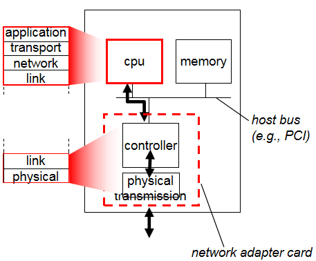

网卡是工作在链路层的网络组件，是局域网中连接计算机和传输介质的接口，不仅能实现与局域网传输介质之间的物理连接和电信号匹配，还涉及帧的发送与接收、帧的封装与拆封、介质访问控制、数据的编码与解码以及数据缓存的功能等。网卡的其他功能还有监控上传及下载流量，控制网速稳定的作用。

链路层提供的服务包括：

-   成帧（framing）。将网络层数据报用链路层帧封装起来。
-   可靠交付（reliable data transfer）。保证无差错地传递网络层数据报，特别对于误码率较高的无线链路。许多有线的链路层不提供可靠交付服务。
-   流量控制（flow control），差错检测（error detection）和纠正（correction）。

>   **单工通信**：
>
>   - 在单工通信中，数据只能在一个方向上进行传输。这意味着通信双方之间只有一个方向上的数据流动。
>   - 一个典型的例子是广播电台。听众可以接收广播电台传输的信息，但不能向广播电台发送信息。信息只能单向流动，从广播电台到听众。
>
>   **半双工通信**：
>
>   - 在半双工通信中，数据可以在两个方向上进行传输，但不能同时进行。这意味着通信双方可以交替地发送和接收数据，但不能同时进行发送和接收。
>   - 一台对讲机就是一个半双工通信的例子。用户可以按下按钮说话（发送数据），然后松开按钮听对方的回应（接收数据）。在同一时间内，对讲机只能进行发送或接收操作，而不能同时进行。
>
>   **全双工通信**：
>
>   - 在全双工通信中，数据可以在两个方向上同时进行传输。这意味着通信双方可以同时发送和接收数据，而不需要交替进行。
>   - 一个典型的例子是电话通话。通话双方可以同时说话和听对方说话，数据可以双向传输，而不需要等待或交替。

**局域网架构（补充内容）**

在IEEE802参考模型中，链路层被划分为两个子层：逻辑链路控制子层（Logical Link Control Sublayer，LLC）和媒体访问控制子层（Medium Access Control Sublayer，MAC）。

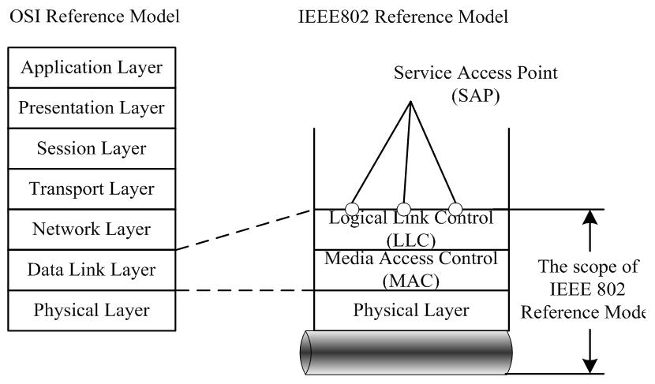

LLC一般只在无线链路中实现，功能包括：流量控制（flow control）和可靠交付（reliable data transfer）。

MAC在有线无线链路中都会实现，功能包括：帧的封装和解封装，地址解析（Address Resolution），差错检测，协调多个节点共享单个广播链路（或者说解决多路访问问题，这是MAC的主要功能）。MAC层的功能在本章重点介绍。

## 差错检测和纠正

**奇偶校验（parity checking）**

1.   如果要发送包含d个比特的数据，发送方加上一个额外的校验比特。如果采用偶校验，则使这（d+1）个比特中1的总数为偶数。
2.   接收方接收（d+1）个比特，如果采用偶校验，但是1的总数为奇数，则检查出错误。但是没有差错纠正能力。

**检验和（checksum）**

1.   对于数据D，发送方计算所有数据16比特字的和，如果溢出则回卷（指加到最后一位）。
2.   求这个和的反码（就是将结果的0换成1，1换成0）。
3.   将数据与检验和发送给接收方。
4.   接收方将数据和检验和的所有16比特字加到一起，如果结果全为1，则正确，反之出错。

**循环冗余检测（Cyclic Redundancy Check，CRC）**

1.   接收方和发送方提前规定一个生成模式G，包含（r+1）个比特。
2.   发送方要发送一个包含 d 比特的数据D，使用公式 $R=(D\times2^r) \mod G$ 来生成R。这里的二进制算式不进位，不借位。R包含 r 个比特。再将 D+R 共（d+r）个比特发给接收方。
3.   接收方计算（D+R）除以 G ，如果余数为0，则正确，反之有错误。
4.   CRC可以检测到连续的 r 比特或者更少的误差。

>   问：对于CRC生成多项式$x^4+x^2+1$，接收方收到`111011001`，是否出错？
>   答：G=10101，r=4，111011001 mod 10101 不等于 0，出错。
>
>   问：data: 1101011011。G:10011。求CRC。
>
>   答：$R=(data\times2^4) \mod G=1110$
>   

## 多路访问链路和协议

媒体访问控制（别名介质访问控制，Medium Access Control Sublayer，MAC）协议，主要功能是协同局域网上所有计算机发送帧的行为，有效避免帧冲突的发生，提高共享信道的利用率。

在一个共享广播信号的链路中，如何协调多个发送和接收节点的访问称为**多路访问（Multiple Access）问题**。因为当多个节点在同一条链路上传输帧时，多个帧发生**碰撞（collide）**，它们的信息都被完全破坏了。**多路访问协议（multiple access protocol）**规范多个节点在共享广播信道上的传输行为。

这些多路访问协议划分为：

-   信道划分协议（Channel Partitioning Protocols）
    -   时分多路复用（time division multiple access，TDMA）
    -   频分多路复用（frequency division multiple access，FDMA）
-   随机接入协议（Random Access Protocols）
    -   时隙ALOHA（slotted ALOHA）
    -   ALOHA
    -   载波监听多路访问（Carrier Sense Multiple Access，CSMA）
    -   具有碰撞检测的载波监听多路访问（Carrier Sense Multiple Access with Collision Detection，CSMA/CD）
    -    具有碰撞避免的载波监听多路访问（Carrier Sense Multiple Access with Collision Avoidance，CSMA/CA）
-   轮流协议（taking-turns protocols）
    -   轮询协议（polling protocol）。主节点以循环的方式轮询（poll）每个节点。
    -   令牌传递协议（token-passing protocol）。传递令牌，有令牌才发送帧。

## 时隙ALOHA

when node obtains fresh frame, transmits in next slot

-   if no collision: node can send new frame in next slot
-   if collision: node retransmits frame in each subsequent slot with prob. p until success

Max efficiency = 1/e = 0.37

## ALOHA

unslotted Aloha: simpler, no synchronization

when frame first arrives，transmit immediately，if collision， node retransmits frame later with prob. p until success

Max efficiency = 1/(2e) = 0.18

## CSMA/CD（重要）

CSMA/CD：Ethernet’s Media Access Control (MAC) policy，**带冲突检测的载波侦听多路访问协议**

IEEE 802.3标准：以CSMA/CD技术为基础的局域网标准。

**运行过程**

1.   帧已经准备好，随时可以发送。
2.   如果监听到信道空闲，则开始传输帧。否则等待直到信道空闲。
3.   在传输过程中，监听是否有其他的帧信号。
4.   如果在传输过程中没有其他的帧信号，顺利传输结束。
5.   如果有碰撞，立即停止传输，在等待一个随机时间量后回到步骤2。


>   -   Nonpersistent CSMA：非持续式： 经侦听，如果介质空闲，开始发送，如果介质忙，则等待一个随机分布的时间，然后重复步骤 1 
>       优点：等待一个随机时间可以减少再次碰撞冲突的可能性 
>       缺点：如果在这个随机时间内介质上没有数据传送，则会发生浪费 
>   -   1-persistent CSMA：1-持续式： 经侦听，如介质空闲，开始发送 如介质忙，持续侦听，一旦空闲立即发送 如果发生冲突，等待一个随机分布的时间再重复步骤 1 
>       优点：持续式的延迟时间要少于非持续式 
>       缺点：如果两个以上的站等待发送，一旦介质空闲就一定会发生冲突
>   -   P-persistent CSMA：经侦听，如介质空闲，那么以 p 的概率发送，以(1–p)的概率延迟一个时间单元发送如介质忙，持续侦听，一旦空闲重复步骤 1 如果发送已推迟一个时间单元，再重复步骤 1
>
>   
>
>   IEEE 802.3 uses 1-persistent
>
>   To ensure backoff maintains stability, IEEE 802.3 and Ethernet use binary exponential backoff

**二进制指数后退**

After aborting, NIC enters exponential backoff: after mth collision, NIC chooses K at random from {0,1,2,…,2m-1}. NIC waits K·512 bit times, returns to Step 2（waits until channel idle, then transmits）

Bit time: .1 microsec for 10 Mbps Ethernet ;for K=1023, wait time is about 50 msec

Delay time is selected using binary exponential backoff

1.   1st time: choose K from {0,1} then delay = K * 51.2us
2.   2nd time: choose K from {0,1,2,3} then delay = K * 51.2us
3.   nth time: delay = K x 51.2us, for K=0..2n – 1Note max value for k = 1023
4.   give up after several tries (usually 16)Report transmit error to host

**最小帧长**

竞争时间片（contention slot）的长度为信道最大传输延迟T的2倍。因为一个站点发送数据后，最多需经2T的时间才能检测到冲突。竞争时间片也叫冲突检测时间。

对于MAC最短帧，发送时间必须大于冲突检测时间，才能检测到是否冲突。因此：
$$
最短帧长=最大传输延迟\times 2 \times 数据传输速率
$$
或者：
$$
最短帧长=2 \times 数据传输速率(单位为bps) \times \frac{距离}{信号传播速度(单位为m/s)}
$$
如果在2.5公里长的信道上，2T为51.2µs，数据传输速率为10Mbps，最小帧长=51.2µs x10Mbps=512 bit=64 Byte

如果在某网络上，数据传输速率为1Gbps，电缆长6km，信号在电缆中的速度为200,000km/s，$最小帧长=2\times \frac{6km}{2000000km/s} \times 1Gbps = 7500 Byte$

## ARP协议（重要） 

地址解析协议（Address Resolution Protocol，ARP）将网络层IP地址与链路层MAC地址做转换。

>   MAC地址（Media Access Control Address），直译为媒体访问控制地址，也称为局域网地址、MAC地址、以太网地址或物理地址（明明是链路层却习惯说是物理地址）。
>
>   -   负责链路层寻址。
>   -   一共48位，分为6部分，每部分用2个十六进制数表示，比如：`1A-2F-BB-76-09-AD`，以及广播地址`FF-FF-FF-FF-FF-FF`。
>   -   在网络接口卡NIC中保存，一般认为是全世界独一无二的，出厂后不可更改的，永久的。
>
>   与IP形成对比的是，IP地址是通过DHCP协议动态获取的，也是可变的。路由器与主机的每一个接口对应一个IP地址，网络接口卡，MAC地址。而链路层的交换机没有对应的IP地址，网络接口卡，MAC地址。

每个主机和路由器在内存中都有一张**ARP表（ARP table）**，记录了IP地址与MAC地址的映射关系，格式为`IP address; MAC address; TTL（Time To Live）`，比如：

```
  Internet Address      Physical Address      TTL
  210.30.97.1           00-01-f4-72-e1-67     13:45:00
  210.30.97.26          00-11-09-3d-78-01     13:52:00
  210.30.97.36          00-11-09-3d-79-05     13:59:00
```

如果正在寻找`210.30.97.1`的MAC地址，那么可以根据ARP表直接查出是`00-01-f4-72-e1-67`，如果要寻找的IP地址不在ARP表中，遵循以下步骤：

1.   发送方发送一个ARP查询分组，包含要查询的目标IP地址。MAC地址部分使用广播地址`FF-FF-FF-FF-FF-FF`向所有节点广播帧。
2.   收到查询分组的适配器检查自己的IP是否与目标IP匹配，若不匹配则丢弃分组。若匹配则在一个标准帧中向发送方返回ARP响应分组。
3.   发送方收到ARP响应分组，将`IP address; MAC address; TTL（Time To Live）`记录在ARP表中。

ARP分组（ARP packet）封装在链路层帧中，因此从封装来说，ARP属于网络层。从功能来说，为链路层服务。考试时答链路层。

>   补充：如果要将数据发送到子网以外的接收方，发送方的目标IP肯定是接收方IP，但目标MAC地址是什么？
>
>   如果目标MAC地址是接收方MAC地址，则这个子网内的所有主机和路由器都不会转发这个分组，因为在解封装到链路层时，发现接收方MAC地址与自身MAC地址不匹配后丢弃，这个分组哪也去不了。
>
>   因此目标MAC地址应当是路由器（网关）的MAC地址，这样路由器才会处理这个分组，并且向正确的接口转发。当然转发前会修改目标MAC地址为下一跳的路由器MAC地址。
>
>   在到达接收方漫长的网络旅途中，**目标IP恒定不变，而目标MAC地址不断改变**。

## 以太网帧格式

之前我们讨论的差错检测，多路访问协议，ARP协议都是附属链路层的“工具”，现在我们来看链路层报文的具体实现方式——以太网帧（或者称为MAC帧）。


-   前同步码，格式固定，64位。
-   地址都是MAC地址，所以48位，如果接收方检测到目的MAC地址与自身MAC地址不匹配，丢弃该帧。
-   数据长度可变，46到1500字节。
-   不算前同步码的话，以太网帧长度64到1518字节。


**以太网技术与标准**

以太网技术是一种有线局域网技术，使用二进制指数后退的CSMA/CD多路访问协议，为网络层提供无连接，无确认，不可靠的服务。严谨来说，以太网技术同时涉及链路层和物理层，考试答链路层。

在相同的MAC协议以及帧格式控制下，物理层有多种技术规格：

-   10Base2：10 Mbps 基带同轴电缆（coax cable）
-   10Base5：10 Mbps 基带粗同轴电缆
-   10Base-T：10 Mbps 双绞线（Twisted Pair，T ）
-   100Base-TX：100 Mbps 五类双绞线
-   100Base-FX：100 Mbps 光纤（Fiber Optics，F）
-   1000Base-FX：1Gbps 光纤

>   -   **基带（Baseband）**：信息源（发终端）发出的没有经过调制（频谱搬移和变换）的原始电信号所固有的频带（频率带宽），称为基本频带，简称基带。**可以理解为数字信号**。
>   -   **宽带（Broadband）**：**可以理解为模拟信号**。

## 交换机原理

交换机是链路层设备，端口没有对应的IP和MAC地址，对于主机是透明的（transparent），是即插拔（plug-and-play），自学习的（self-learning）。

each switch has a switch table, each entry:`MAC address of host, interface to reach host, time stamp`

switch learns which hosts can be reached through which interfaces，when frame received, switch “learns”  location of sender

-   frame destination unknown：flood
-   destination A location known：selective send

switches can be connected together

switch installation breaks subnet into LAN segments，segments become separate collision  domains

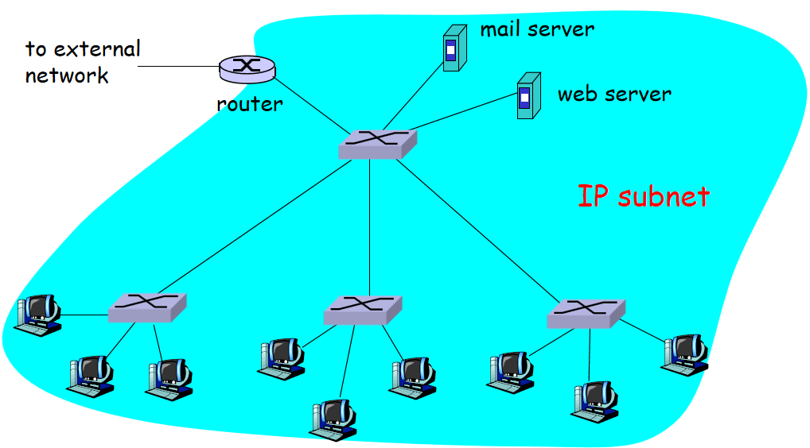

## CSMA/CA

IEEE 802.11标准是无线局域网标准，可以简单理解为Wi-Fi（Wireless Fidelity，直译“无线保真”）。使用CSMA/CA。

基本服务集（Basic Service Set，BSS）

接入点（Access Point，AP）

802.11b: 2.4GHz-2.485GHz频谱划分为11个不同频率的信道

 每个AP选择一个频率(信道)

 存在干扰可能: 相邻的AP可能选择相同的信道！

主机: 必须与某个AP关联(associate)

 扫描信道，监听包含AP名称(服务集标识符-SSID )和MAC地址的信标(beacon)帧

 选择一个AP进行关联

 可能需要进行身份认证

 典型情形：运行DHCP获取IP地址等信息

802.11没有使用CSMA/CD，几个原因：

-   为了检测碰撞需要监听信号，但是在无线信道上，接收信号的强度很小，硬件代价较大。
-   因为在无线信道上存在隐藏终端，信号衰落问题，无法检测到所有碰撞。

因此，使用CSMA/CA的目标转为尽全力**避免碰撞**，一旦帧开始发送，就算发生碰撞也不会中断，会一直发送完。

当发送较短的帧时，过程如下：

1.   当监听到信道持续空闲了**分布式帧间隔（Distributed Inter-frame Spacing，DIFS）**时间后，发送帧。
2.   否则（监听到信道忙），开始二进制指数后退倒计时，注意只在信道空闲时计时器倒计时，当计时器超时时，发送帧。（因为只在信道空闲时计时器倒计时，所以超时即空闲）
3.   接收方收到帧后，等待**短帧间间隔（Short interframe space，SIFS）**时间后发送ACK确认帧。
4.   如果发送方收到确认帧，则确认发送完成。
5.   否则（发送方没有收到确认帧），增加二进制指数后退时间，重复第二步。


>   问：为什么要等待**帧间间隔（interframe space，IFS）**？
>
>   答：为了尽量避免碰撞，802.11规定，所有的站在完成发送后，必须再等待一段很短的时间（继续监听）才能发送下一帧。这段时间的通称是帧间间隔IFS。帧间间隔的长短取决于该站要发送的帧的类型。高优先级的帧需要等待的时间较短，因此可以优先获得发送权。
>
>   帧间间隔的时间从小到大列出如下：
>
>   1.   SIFS：短帧间间隔。SIFS是最短的时间区段，用来间隔需要立即响应的帧，如控制帧（RTS/CTS/ACK）等。在帧交换顺序地两次传输之间使用最短间隔，可以防止其它正在等待介质的站点试图使用介质。
>   2.   PIFS：集中协调功能帧间间隔，只能够由工作于PCF模式的站点来使用。
>   3.   DIFS：分布协调功能帧间间隔，只能够由工作于DCF模式的站点来使用。
>   4.   EIFS: 在前一帧出错的情况下，发送节点 不得不延迟 EIFS 而不是DIFS时间段，再发送下一帧。

由于帧开始发送后就算发生碰撞也不会中断，碰撞的代价很大，当传输较大的帧时，引入RTS和CTS机制，过程如下：

1.   当监听到信道持续空闲了DIFS时间后，发送方向AP发送一个短**发送请求（request to send，RTS）**帧，表示想要预约信道。
2.   AP收到帧后，等待SIFS时间后，广播一个短**允许发送（clear to send，CTS）**帧作为对RTS的响应。由于广播，CTS帧可以被所有结点接收，对于选中的发送方，可以发送数据帧，其他结点推迟发送。
3.   发送方等待SIFS时间后，开始发送数据帧，其他节点暂停计时器并等待。
4.   接收方收到数据帧后，等待SIFS时间后，发送ACK确认帧。

补充：RTS和CTS机制可以解决隐藏中断的问题。


下图是802.11帧格式，看看就行


# 总结：访问`www.baidu.com`时发生了什么

1.   一个新的主机到达某机构网络，这时它什么也没有，不知道周围的主机，路由器，DNS服务器，网关，不知道自己的IP地址，只知道自己的MAC地址。（MAC地址写在自己的网卡里）
2.   通过DHCP协议得知自己的IP地址，以及网关与DNS服务器的IP地址。
3.   通过ARP协议得知网关的MAC地址。（需要自己的IP地址与网关的IP地址）
4.   使用DNS协议得知域名`www.baidu.com`对应的IP地址。（需要自己的IP地址，DNS服务器的IP地址，网关的MAC地址）
5.   使用TCP协议建立与百度服务器的连接（需要自己的IP地址，网关的MAC地址，百度服务器的IP地址）
6.   使用HTTP协议接收来自百度的网页。（需要TCP连接，自己的IP地址，网关的MAC地址，百度服务器的IP地址）

换一种视角：

- 客户端浏览器通过DNS解析到`www.baidu.com`的IP地址220.181.27.48，通过这个IP地址找到客户端到服务器的路径。客户端浏览器发起一个HTTP会话到220.161.27.48，然后通过TCP进行封装数据包，输入到网络层。
- 在客户端的传输层，把HTTP会话请求分成报文段，添加源和目的端口，如服务器使用80端口监听客户端的请求，客户端由系统随机选择一个端口如5000，与服务器进行交换，服务器把相应的请求返回给客户端的5000端口。然后使用IP层的IP地址查找目的端。
- 客户端的网络层不用关系应用层或者传输层的东西，主要做的是通过查找路由表确定如何到达服务器，期间可能经过多个路由器，这些都是由路由器来完成的工作，我不作过多的描述，无非就是通过查找路由表决定通过那个路径到达服务器。
- 客户端的链路层，包通过链路层发送到路由器，通过邻居协议查找给定IP地址的MAC地址，然后发送ARP请求查找目的地址，如果得到回应后就可以使用ARP的请求应答交换的IP数据包现在就可以传输了，然后发送IP数据包到达服务器的地址。


$$
\Huge{ ♫\  \mathfrak{Focus} \ On \ \mathbb{The} \ \mathscr{Headline} \ ♫}
$$

$$
\Huge{\mathscr{-The \quad End-}}
$$


